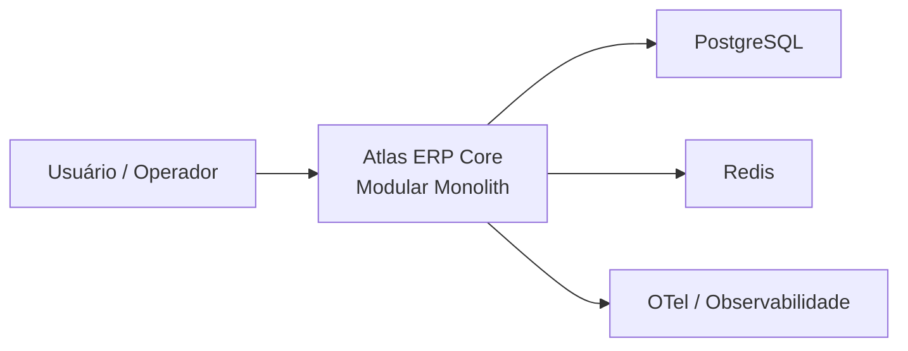
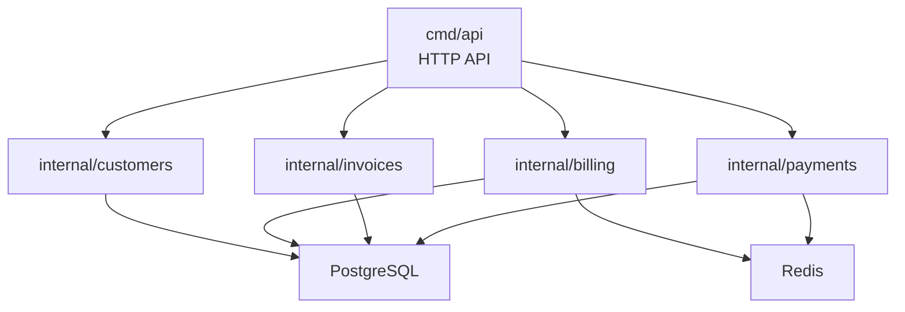
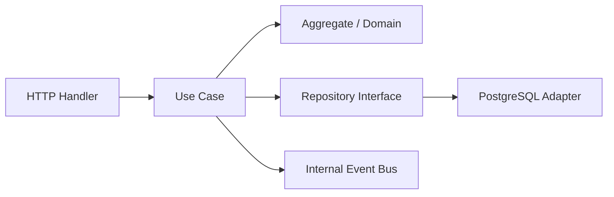

# AGENTS.md

## Nota de contexto

Este repositório está em estágio inicial e, neste momento, contém apenas artefatos básicos de versionamento.

Este documento descreve a arquitetura-alvo, as convenções obrigatórias e o contrato de contribuição que deve orientar toda evolução futura do sistema. Quando houver divergência entre o estado atual do repositório e este documento, trate este arquivo como a referência arquitetural a ser seguida.

---

## Propósito

Este repositório existe para demonstrar como projetar e construir um **modular monolith** com disciplina arquitetural, usando:

- Domain-Driven Design (DDD)
- Clean Architecture
- Event-Driven patterns internos
- Caminho claro de evolução para microservices

O objetivo não é apenas entregar funcionalidades. O objetivo é **preservar limites modulares, linguagem de domínio e qualidade estrutural** enquanto o sistema cresce.

---

## Visão geral da arquitetura

### Princípios obrigatórios

1. **Modular Monolith**
   O sistema é um único artefato de deploy, porém dividido internamente em módulos com fronteiras claras.

2. **DDD**
   O código deve refletir bounded contexts, aggregates, entities, value objects, repositories e domain events.

3. **Clean Architecture**
   As dependências sempre apontam para dentro:

   ```text
   interface -> application -> domain
   ```

4. **Event-Driven interno**
   A comunicação entre módulos deve privilegiar eventos de domínio internos, evitando chamadas diretas entre implementações.

5. **Evolução segura**
   O monólito modular deve permitir extração futura de módulos para serviços independentes sem reescrever o domínio.

### Regra de ouro

> Se um módulo depender da implementação interna de outro módulo, a arquitetura está quebrada.

---

## Estado atual vs arquitetura-alvo

### Fato atual

- O repositório ainda não possui código-fonte do sistema.
- Ainda não existem módulos, handlers, use cases, migrations ou pipelines implementados.

### Convenção mandatória para evolução

- Toda implementação futura deve seguir a arquitetura descrita neste documento.
- Nenhuma decisão estrutural deve contradizer os limites de módulo, as camadas arquiteturais ou as regras de teste descritas aqui.

---

## Bounded Contexts de referência

Os bounded contexts iniciais do projeto são:

- `customers`
- `billing`
- `invoices`
- `payments`

Esses módulos representam a baseline arquitetural do sistema. Eles podem evoluir, mas qualquer novo módulo deve seguir a mesma disciplina de encapsulamento.

### Responsabilidades-alvo por módulo

#### `customers`

- Domínio de cadastro, identificação e ciclo de vida de clientes.
- Services esperados: `CreateCustomer`, `UpdateCustomerProfile`, `DeactivateCustomer`.
- Jobs esperados: `RebuildCustomerProjections`, `SyncCustomerReadModel`.
- Models esperados: `Customer`, `CustomerDocument`, `CustomerStatus`, `CustomerCreated`.

#### `billing`

- Domínio de cobrança, cálculo de valores e políticas de vencimento.
- Services esperados: `GenerateCharge`, `ApplyBillingPolicy`, `CloseBillingCycle`.
- Jobs esperados: `CloseOverdueCharges`, `RecalculateBillingCycle`.
- Models esperados: `Charge`, `BillingPolicy`, `BillingCycle`, `ChargeGenerated`.

#### `invoices`

- Domínio de emissão, consolidação e acompanhamento de invoices.
- Services esperados: `GenerateInvoice`, `IssueInvoice`, `CancelInvoice`.
- Jobs esperados: `ReconcileInvoices`, `RetryInvoiceDispatch`.
- Models esperados: `Invoice`, `InvoiceLine`, `InvoiceStatus`, `InvoiceGenerated`.

#### `payments`

- Domínio de processamento, confirmação e estorno de pagamentos.
- Services esperados: `ProcessPayment`, `ConfirmPayment`, `RefundPayment`.
- Jobs esperados: `RetryPaymentSettlement`, `ExpirePendingPayments`.
- Models esperados: `Payment`, `PaymentAttempt`, `PaymentStatus`, `PaymentProcessed`.

Esses nomes são referências de arquitetura-alvo e **não** inventário de código já implementado.

---

## Estrutura padrão do repositório

Estrutura esperada para a evolução do projeto:

```text
.
├── AGENTS.md
├── CHANGELOG.md
├── README.md
├── Makefile
├── cmd/
│   └── api/
├── configs/
│   ├── app/
│   └── observability/
├── docs/
│   ├── adr/
│   └── diagrams/
├── internal/
│   ├── customers/
│   ├── billing/
│   ├── invoices/
│   └── payments/
├── migrations/
├── pkg/
│   └── shared/
├── scripts/
└── test/
    ├── integration/
    └── functional/
```

### Estrutura padrão de módulo

Cada módulo deve viver em `internal/<module-name>`:

```text
internal/customers/
├── domain/
│   ├── entity.go
│   ├── value_object.go
│   ├── repository.go
│   └── events.go
├── application/
│   ├── usecase/
│   └── dto/
├── infrastructure/
│   ├── repository/
│   ├── http/
│   └── persistence/
└── module.go
```

### Estrutura do diretório de conteúdo e documentação

- `docs/adr/`: Architectural Decision Records.
- `docs/diagrams/`: diagramas Mermaid e artefatos C4.
- `configs/`: configuração por ambiente e observabilidade.
- `scripts/`: automações de setup, CI local e utilitários.
- `test/integration/`: testes de integração com infraestrutura real.
- `test/functional/`: testes funcionais e fluxos críticos.

---

## Stack tecnológico completo

Esta é a stack baseline do projeto:

### Linguagem e runtime

- Go

### HTTP e composição da aplicação

- `chi` para roteamento HTTP
- `cmd/api` como ponto de entrada
- `Makefile` como interface preferencial de automação

### Persistência

- PostgreSQL como banco transacional principal
- `pgx` para acesso ao PostgreSQL
- `golang-migrate` para migrations

### Cache, coordenação e suporte a eventos

- Redis para cache, locks leves, deduplicação e suporte operacional
- Event bus interno in-memory ou adaptador equivalente, preparado para futura estratégia outbox

### Observabilidade

- Logs estruturados
- Correlation ID obrigatório
- OpenTelemetry para traces e métricas
- Exportação OTLP para backend observability

### Containerização e ambiente local

- Docker
- Docker Compose

### CI e qualidade

- GitHub Actions
- Testes unitários
- Testes de integração
- Testes funcionais
- `testcontainers-go` para testes de integração com dependências reais

---

## Variáveis de ambiente

As variáveis abaixo compõem a baseline da aplicação. Elas devem ser documentadas no `README.md` e revisadas sempre que novas capacidades forem adicionadas.

| Variável | Obrigatória | Descrição |
| --- | --- | --- |
| `APP_NAME` | Sim | Nome lógico do serviço/aplicação. |
| `APP_ENV` | Sim | Ambiente atual, por exemplo `local`, `dev`, `staging`, `prod`. |
| `APP_PORT` | Sim | Porta HTTP da aplicação. |
| `LOG_LEVEL` | Sim | Nível de log, por exemplo `debug`, `info`, `warn`, `error`. |
| `DATABASE_URL` | Sim | String de conexão principal do PostgreSQL. |
| `DATABASE_MAX_OPEN_CONNS` | Não | Limite de conexões abertas com o banco. |
| `DATABASE_MAX_IDLE_CONNS` | Não | Limite de conexões ociosas com o banco. |
| `DATABASE_CONN_MAX_LIFETIME` | Não | Tempo máximo de vida de conexão. |
| `REDIS_URL` | Sim | String de conexão do Redis. |
| `HTTP_READ_TIMEOUT` | Não | Timeout de leitura do servidor HTTP. |
| `HTTP_WRITE_TIMEOUT` | Não | Timeout de escrita do servidor HTTP. |
| `HTTP_IDLE_TIMEOUT` | Não | Timeout idle do servidor HTTP. |
| `OTEL_SERVICE_NAME` | Sim | Nome do serviço reportado ao pipeline de observabilidade. |
| `OTEL_EXPORTER_OTLP_ENDPOINT` | Não | Endpoint OTLP para traces e métricas. |
| `OTEL_EXPORTER_OTLP_HEADERS` | Não | Headers para autenticação OTLP. |
| `OTEL_TRACES_SAMPLER` | Não | Estratégia de sampling de traces. |
| `CORRELATION_ID_HEADER` | Não | Header HTTP usado para correlação entre requests. |

Novas variáveis de ambiente só podem ser adicionadas com:

- atualização deste `AGENTS.md`
- atualização do `README.md`
- registro em `CHANGELOG.md`

---

## Regras obrigatórias de engenharia

### SOLID e Object Calisthenics

- Aplicar SOLID em serviços, use cases, adapters e composição da aplicação.
- Aplicar Object Calisthenics para manter objetos coesos, métodos curtos, baixo acoplamento e encapsulamento real.
- Evitar classes ou structs anêmicas quando houver comportamento de domínio relevante.

### Limites modulares

- Um módulo não pode importar outro módulo para acessar sua implementação interna.
- Comunicação síncrona entre módulos só pode acontecer via interface publicada na borda do módulo.
- Comunicação assíncrona entre módulos deve preferir eventos de domínio.
- Acesso a banco é restrito ao módulo dono do dado.

### Camadas

- `domain` não depende de framework, banco, HTTP ou detalhes de infraestrutura.
- `application` orquestra casos de uso, DTOs e portas.
- `infrastructure` implementa adapters, handlers, persistência e integrações.

### Regras proibidas

#### Acoplamento direto entre módulos

```go
// PROIBIDO
import "internal/payments"
```

#### Regra de negócio em handler

```go
// PROIBIDO
func handler() {
    // regra de negócio aqui
}
```

#### Modelo mutável compartilhado

- Cada módulo é dono do seu domínio e dos seus invariantes.

---

## Estratégia de testes

Criar e manter, no mínimo:

- testes unitários
- testes de integração
- testes funcionais

### Mapeamento por camada

- `domain`: testes unitários puros para entidades, value objects e regras invariantes.
- `application`: testes unitários e de orquestração para use cases e contratos entre portas.
- `infrastructure`: testes de integração para repositórios, handlers, migrations e integrações externas.
- fluxos críticos: testes funcionais ou E2E cobrindo jornadas de negócio relevantes.

### Regras de qualidade

- Toda correção de bug deve vir acompanhada de teste que falha antes e passa depois.
- Toda nova regra de negócio deve nascer orientada por teste.
- Testes frágeis, acoplados a detalhes internos ou altamente dependentes de timing devem ser reescritos.
- Usar `testcontainers-go` para cenários de integração com PostgreSQL e Redis.

### Instruções de TDD

Adotar o ciclo:

1. Escrever um teste que falha.
2. Implementar o mínimo para fazê-lo passar.
3. Refatorar preservando comportamento.

TDD é obrigatório para regras de domínio, use cases e contratos críticos entre módulos.

---

## Observabilidade obrigatória

- Logs estruturados em todos os fluxos relevantes.
- Correlation ID propagado da entrada HTTP até jobs e eventos internos.
- Métricas básicas de latência, erro e throughput.
- Código preparado para tracing distribuído futuro, mesmo que o sistema ainda seja monolítico.

### Convenções de logging

- Logs devem usar mensagens objetivas e contextualizadas.
- Logs devem ser textuais, consistentes e sem emojis.
- Nunca registrar segredo, token, senha ou payload sensível.

Exemplos:

```text
INFO  api started port=8080 env=local
INFO  invoice generated invoice_id=inv_123 customer_id=cus_456
WARN  payment pending payment_id=pay_789 retry_in=30s
ERROR database query failed correlation_id=abc-123 err="timeout"
```

---

## Comunicação entre módulos

| Tipo | Permitido |
| --- | --- |
| Sync | Apenas via interfaces de borda |
| Async | Preferencial, via eventos de domínio |
| Banco | Apenas dentro do módulo dono do dado |

### Exemplo de evento de domínio

```go
type OrderCreated struct {
    OrderID string
}
```

### Intenção arquitetural

- Eventos internos devem reduzir acoplamento.
- O contrato do evento deve ser explícito e estável.
- O sistema deve estar pronto para estratégia outbox quando a extração de serviços se tornar necessária.

---

## Design patterns do projeto

Os padrões abaixo formam a baseline de implementação:

- **Repository Pattern** para persistência na borda do domínio.
- **Use Case Pattern** para coordenação de comportamento de aplicação.
- **Dependency Inversion** para dependências entre camadas e adapters.
- **Domain Events** para comunicação interna desacoplada.
- **Factory** quando a criação de agregados exigir invariantes ou montagem complexa.
- **Anti-Corruption Layer** para integrações externas e futuras extrações de serviço.
- **Outbox-ready mindset** para publicação confiável de eventos quando houver necessidade de distribuição.

Evitar padrões cerimoniais sem ganho real. Preferir simplicidade, coesão e clareza.

---

## Visualização da arquitetura

Todos os diagramas devem ser mantidos em `docs/diagrams/`.

### Regras

- Usar Mermaid para diagramas versionados no repositório.
- Organizar diagramas conforme o C4 Model:
  - C1: contexto
  - C2: containers
  - C3: componentes
- Atualizar diagramas sempre que houver mudança estrutural relevante.

### Exemplo C1 em Mermaid



### Exemplo C2 em Mermaid



### Exemplo C3 em Mermaid



---

## ADR e log de decisões

Toda decisão estrutural relevante deve ser registrada em `docs/adr/`.

Exemplos:

- por que modular monolith
- por que Go
- por que PostgreSQL
- por que Redis
- por que não microservices neste estágio

Documentar decisões, não suposições.

---

## Estratégia de evolução

### Fase 1

- Modular Monolith

### Fase 2

- Extração gradual de módulos com fronteiras já estabilizadas

### Fase 3

- Sistema distribuído orientado a eventos

A prioridade atual é manter fronteiras corretas, e não antecipar complexidade operacional.

---

## Trade-offs

### Benefícios

- Deploy mais simples
- Menor custo operacional
- Modelagem de domínio forte
- Evolução incremental mais segura

### Custos

- Requer disciplina para manter fronteiras
- Violações de módulo podem crescer silenciosamente se não forem monitoradas
- Eventos mal definidos podem criar acoplamento indireto

---

## Common hurdles

### 1. Acoplamento entre módulos

- Sintoma: um módulo acessa diretamente struct, repository ou adapter de outro.
- Solução: substituir por interface de borda ou evento de domínio.

### 2. Vazamento de infraestrutura para o domínio

- Sintoma: `domain` conhece SQL, HTTP, Redis ou detalhes de framework.
- Solução: mover dependência para adapter em `infrastructure` e preservar portas no domínio ou aplicação.

### 3. Handlers gordos

- Sintoma: validação de regra, branching de negócio e persistência dentro do endpoint.
- Solução: mover fluxo para use case e deixar o handler apenas como adaptador de entrada.

### 4. Testes frágeis

- Sintoma: testes quebram por detalhes de implementação sem mudança de comportamento.
- Solução: testar contrato e comportamento observável, não detalhes internos acidentais.

### 5. Falta de correlation ID

- Sintoma: não é possível rastrear uma requisição por logs, jobs e eventos.
- Solução: padronizar propagação desde a borda HTTP e exigir enrichment em logs.

### 6. Eventos sem contrato

- Sintoma: produtores e consumidores divergem silenciosamente.
- Solução: definir payload estável, dono do evento e versionamento quando necessário.

### 7. README e CHANGELOG desatualizados

- Sintoma: setup, comandos e histórico deixam de refletir a realidade do projeto.
- Solução: tratar documentação como parte da definição de pronto.

---

## Política de atualização do AGENTS.md

O `AGENTS.md` deve evoluir junto com o projeto e nunca pode ficar desatualizado em relação à arquitetura, stack, módulos, comandos, práticas de teste e convenções operacionais.

Atualize este arquivo sempre que houver mudança em qualquer um dos pontos abaixo:

- arquitetura ou limites entre módulos
- stack tecnológica ou ferramentas oficiais do projeto
- variáveis de ambiente
- estrutura de diretórios
- novos módulos, apps, jobs, services ou models de referência
- estratégia de testes
- observabilidade, logging ou convenções operacionais
- comandos do `Makefile`
- processo de documentação, ADR, `README.md` ou `CHANGELOG.md`

Regras obrigatórias:

- nenhuma mudança estrutural relevante pode ser entregue sem revisão do `AGENTS.md`
- se a mudança não exigir edição no arquivo, isso deve ser uma decisão consciente e verificável na revisão
- o `AGENTS.md` deve refletir o estado vigente e a arquitetura-alvo, sem contradizer o repositório
- o checklist pós-implementação deve tratar a revisão deste arquivo como item obrigatório

---

## README.md e CHANGELOG.md

### README.md

O `README.md` deve ser criado e mantido como documentação operacional do projeto, contendo no mínimo:

- visão geral do sistema
- arquitetura resumida
- stack tecnológica
- instruções de setup local
- variáveis de ambiente
- comandos principais
- estrutura de módulos
- estratégia de testes

Toda mudança relevante de setup, arquitetura, módulos, comandos ou observabilidade exige atualização do `README.md`.

### CHANGELOG.md

O `CHANGELOG.md` deve ser criado e mantido continuamente.

Regras:

- registrar toda evolução relevante do sistema
- agrupar mudanças por versão ou marco
- separar claramente o que foi adicionado, alterado, corrigido e removido
- atualizar o changelog no mesmo conjunto de mudanças do código

Categorias sugeridas:

- `Added`
- `Changed`
- `Fixed`
- `Removed`

Nenhuma feature estrutural, alteração de contrato, novo módulo ou mudança operacional relevante deve ser entregue sem atualização do `CHANGELOG.md`.

---

## Comandos principais

O projeto deve centralizar automações no `Makefile` sempre que possível. Esta seção deve ser mantida atualizada conforme os comandos forem sendo implementados.

Comandos baseline esperados:

```makefile
make setup
make up
make down
make fmt
make lint
make test
make test-unit
make test-integration
make test-functional
make migrate-up
make migrate-down
make run
```

Regras:

- Preferir `make <target>` a comandos longos de ferramenta.
- Ao adicionar um novo fluxo operacional recorrente, expor esse fluxo no `Makefile`.
- Atualizar `README.md` e `CHANGELOG.md` quando novos comandos forem introduzidos ou alterados.

---

## Checklist pós-implementação

Toda mudança relevante deve verificar:

- limites modulares preservados
- domínio sem dependência de infraestrutura
- use cases cobrindo a regra de negócio
- testes unitários criados ou atualizados
- testes de integração criados ou atualizados
- testes funcionais criados ou atualizados quando o fluxo for crítico
- logs estruturados e correlation ID presentes
- `AGENTS.md` revisado e atualizado quando necessário
- `README.md` atualizado
- `CHANGELOG.md` atualizado
- ADR criada ou revisada se houver decisão estrutural
- diagramas Mermaid e C4 atualizados quando houver impacto arquitetural

---

## Notas para mantenedores

- Preferir simplicidade a abstrações prematuras.
- Não transformar arquitetura em burocracia vazia.
- Modelar o domínio antes de modelar endpoints.
- Decisões importantes devem ser explícitas, registradas e rastreáveis.
- Este projeto não é sobre CRUD isolado. É sobre modelar domínio, proteger fronteiras e escalar complexidade com disciplina.
