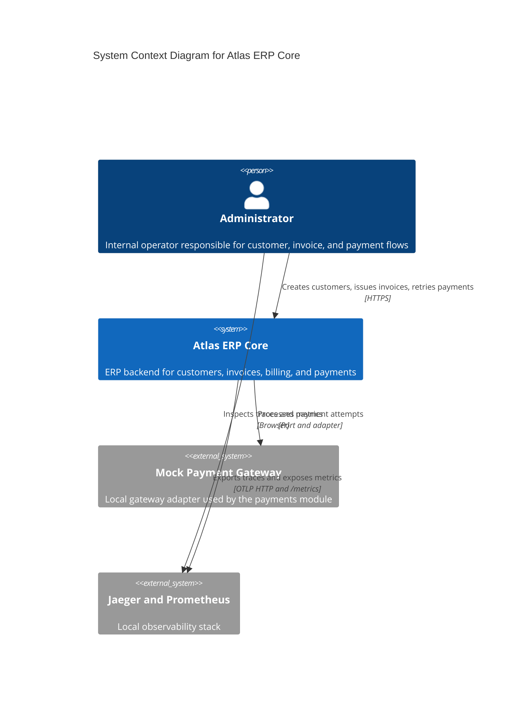
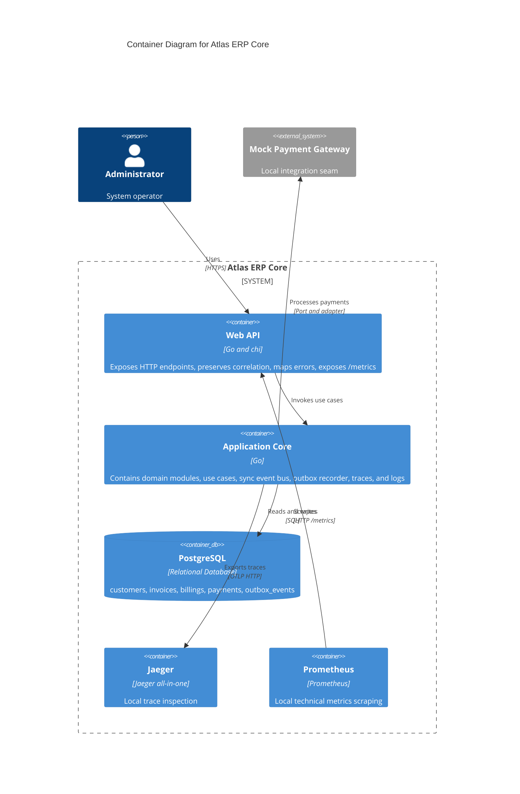
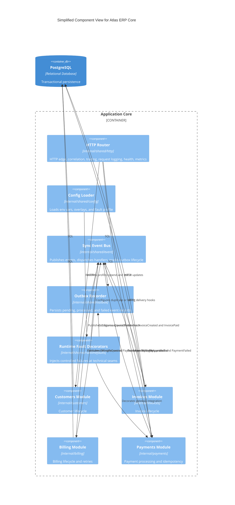

# Atlas ERP Core

Modular Monolith ERP built with Go using DDD, Clean Architecture, and internal Event-Driven patterns.

Portuguese companion: [README.pt-BR.md](README.pt-BR.md)

## Purpose

Atlas ERP Core models a small but real ERP financial backbone for customer registration, invoice issuance, billing generation, payment processing, and invoice settlement.

The project exists for two reasons:

- to implement a transactional ERP core with explicit module boundaries and auditable behavior
- to serve as a portfolio-grade engineering reference that explains architecture, trade-offs, resilience, observability, and future evolution using real code and test evidence

This repository is intentionally optimized for technical clarity over feature volume. The value is in how the system is structured, why it is structured that way, and how safely it can evolve.

## Architectural Vision

Atlas ERP Core uses a Modular Monolith as its primary architectural style, with DDD for domain modeling, Clean Architecture for internal organization, and in-process Event-Driven communication between modules.

These choices solve specific problems:

- Modular Monolith keeps deployment and debugging simple while still enforcing domain boundaries.
- DDD keeps business rules inside aggregates, value objects, and use cases instead of spreading them across handlers and persistence details.
- Clean Architecture keeps dependencies pointing inward, so infrastructure can change without redefining the domain model.
- Internal events reduce direct coupling between modules and prepare the codebase for future extraction without pretending the system is distributed today.

The result is one deployable runtime with explicit contracts, public module surfaces, observable flows, and a documented path toward future distribution if operational pressure justifies it.

## Domain Overview

The active bounded contexts are:

| Module | Responsibility | Role in the system |
| --- | --- | --- |
| `customers` | Customer lifecycle management | Creates, updates, and deactivates customers with document and email validation |
| `invoices` | Invoice issuance and state management | Creates invoices, lists customer invoices, and marks invoices as paid |
| `billing` | Charge lifecycle and retry control | Creates billings from invoices, tracks `attempt_number`, and manages retryable financial state |
| `payments` | Payment execution and result publication | Processes payment attempts, enforces idempotency, classifies failures, and emits payment outcomes |

Shared technical capabilities live in `internal/shared` and cover config, correlation, logging, observability, PostgreSQL access, event dispatch, outbox recording, and controlled fault injection. Shared code is intentionally technical only; business rules stay inside the modules.

### Public module contracts

| Module | Public surface |
| --- | --- |
| `customers` | `ExistenceChecker`, public errors, `public/events` |
| `invoices` | `public/events` |
| `billing` | `PaymentCompatibilityPort`, `BillingSnapshot`, public errors, `public/events` |
| `payments` | `public/events` |

## Architecture Overview (C4)

The diagrams below summarize the current architecture. Deeper component and sequence diagrams remain in [docs/diagrams/architecture.md](docs/diagrams/architecture.md).

### C4 Context



### C4 Container



### C4 Component



## Core Flow

The main end-to-end flow is:

```text
Create Customer -> Create Invoice -> InvoiceCreated -> BillingRequested -> PaymentApproved -> Invoice Paid
```

What happens in practice:

1. An operator creates a customer through `POST /customers`.
2. An operator creates an invoice through `POST /invoices`.
3. The `invoices` module persists the invoice and publishes `InvoiceCreated`.
4. The `billing` module consumes `InvoiceCreated`, creates a billing record, and publishes `BillingRequested`.
5. The `payments` module consumes `BillingRequested`, reserves a payment attempt, calls the gateway, and publishes either `PaymentApproved` or `PaymentFailed`.
6. `billing` and `invoices` react to payment events to finalize billing state and mark the invoice as paid when approval succeeds.

There is also a compatibility path for manual retry:

```text
POST /payments -> reprocess an existing billing after PaymentFailed or technical gateway failure
```

This event-oriented flow keeps modules decoupled while maintaining a single-process runtime and deterministic local debugging.

## Tech Stack

| Area | Technology |
| --- | --- |
| Language | Go 1.26 |
| HTTP | `chi` |
| Persistence | PostgreSQL with `pgx/v5` |
| Migrations | `golang-migrate` |
| Logging | `log/slog` JSON logs |
| Tracing and metrics | OpenTelemetry Go SDK and `otelhttp` |
| Local observability | Jaeger and Prometheus |
| Integration testing | `testcontainers-go` |
| Packaging and local runtime | Docker and Docker Compose |
| CI baseline | GitHub Actions |

## Running the Project

The public documentation uses normal shell commands and Makefile shortcuts. Local wrappers are intentionally not part of the published interface.

### 1. Prepare the environment

```bash
cp .env.example .env
```

Key variables:

| Variable | Required | Default | Purpose |
| --- | --- | --- | --- |
| `APP_PORT` | Yes | - | HTTP port |
| `DB_HOST` | Yes | - | PostgreSQL host |
| `DB_PORT` | Yes | - | PostgreSQL port |
| `DB_USER` | Yes | - | PostgreSQL user |
| `DB_PASSWORD` | Yes | - | PostgreSQL password |
| `DB_NAME` | Yes | - | PostgreSQL database |
| `APP_NAME` | No | `atlas-erp-core` | Logical service name |
| `APP_ENV` | No | `local` | Current environment |
| `LOG_LEVEL` | No | `info` | Structured log level |
| `CORRELATION_ID_HEADER` | No | `X-Correlation-ID` | Correlation header name |
| `ATLAS_FAULT_PROFILE` | No | `none` | Controlled local failure profile |
| `PAYMENT_GATEWAY_TIMEOUT_MS` | No | `2000` | Timeout per payment attempt |
| `OTEL_EXPORTER_OTLP_ENDPOINT` | No | empty | OTLP HTTP trace export endpoint |

### 2. Start the local stack

Quick start:

```bash
make up
```

Underlying command:

```bash
docker compose up --build -d
```

Expected local services:

- API on `http://localhost:8080`
- PostgreSQL on `localhost:5432`
- Jaeger on `http://localhost:16686`
- Prometheus on `http://localhost:9090`

### 3. Run migrations

Make shortcut:

```bash
make migrate-up
```

Underlying command:

```bash
go run ./cmd/migrate --direction up
```

### 4. Run the API from source

Quick start:

```bash
make run
```

Underlying command:

```bash
go run ./cmd/api
```

If you want local traces to appear in Jaeger while running the API outside Compose:

```bash
OTEL_EXPORTER_OTLP_ENDPOINT=http://localhost:4318 make run
```

### 5. Validate health and metrics

```bash
curl http://localhost:8080/health
curl http://localhost:8080/metrics
```

### 6. Run the full test suite

Quick start:

```bash
make test
```

Underlying command:

```bash
go test ./...
```

### HTTP endpoints

| Method | Path | Description |
| --- | --- | --- |
| `GET` | `/health` | Healthcheck |
| `GET` | `/metrics` | Prometheus metrics |
| `POST` | `/customers` | Create customer |
| `PUT` | `/customers/{id}` | Update customer |
| `PATCH` | `/customers/{id}/inactive` | Deactivate customer |
| `POST` | `/invoices` | Create invoice and trigger billing and payment flow |
| `GET` | `/customers/{id}/invoices` | List invoices by customer |
| `POST` | `/payments` | Manually retry payment for an existing billing |

More operational examples live in [docs/commands.md](docs/commands.md).

## Testing Strategy

Atlas ERP Core uses behavior-first validation with multiple layers of evidence.

### Unit tests

Unit tests validate:

- domain invariants and aggregate transitions
- use case orchestration
- event constructors and public event catalog consistency
- HTTP boundary validation and canonical error mapping
- config, logging, correlation, observability, and runtime fault utilities

### Integration tests

Integration tests use real PostgreSQL through `testcontainers-go` and validate:

- persistence and migrations
- outbox append and lifecycle updates
- duplicate delivery protection
- retry flows
- gateway timeout and failure classification
- envelope persistence in `outbox_events`

### Functional tests

Functional tests validate the HTTP contract and system behavior from the edge:

- end-to-end invoice flow
- manual retry after failure
- canonical error bodies and traceability
- observability propagation
- controlled fault profiles through the public API

### Event-driven validation

Event-driven behavior is explicitly covered through tests for:

- publish and consume order
- duplicate `BillingRequested` delivery
- injected consumer failure
- outbox append failure
- invoice transition after `PaymentApproved`

### Failure scenarios under test

The suite includes real coverage for:

- gateway timeout
- intermittent gateway failure with successful manual retry
- duplicated event delivery
- consumer failure during dispatch
- outbox append failure before downstream side effects

## Observability

The repository treats observability as a first-class architectural concern rather than a post-hoc add-on.

### Logs

Logs are structured JSON via `slog` and include contextual fields when applicable:

- `module`
- `request_id`
- `event_id`
- `aggregate_id`
- `correlation_id`
- `trace_id`
- `span_id`
- `event_name`
- `attempt_number`
- `retry_count`
- `failure_category`
- `error_type`

### Correlation

HTTP requests preserve `X-Correlation-ID` by default and expose it as `request_id` in logs and error responses. This keeps business and technical events traceable across the full request path.

### Tracing

OpenTelemetry traces cover:

- HTTP requests
- application use cases
- internal event publish and consume operations
- PostgreSQL queries
- payment gateway integration

Key span names include:

- `http.request {METHOD} {route}`
- `application.usecase {module}.{UseCase}`
- `event.publish {EventName}`
- `event.consume {consumer_module}.{EventName}`
- `db.query {operation} {table}`
- `integration.gateway payments.Process`

Jaeger UI: `http://localhost:16686`

### Metrics

Prometheus metrics are exposed at `GET /metrics` and include signals for:

- HTTP request count, error count, and duration
- event publication and consumption
- event handler failures
- payment retries
- database query duration
- gateway request duration and failures

Prometheus UI: `http://localhost:9090`

## Resilience

Resilience in Atlas ERP Core is deliberately narrow, explicit, and auditable.

### Idempotency

Payments enforce idempotency per `(billing_id, attempt_number)` and persist an `idempotency_key` so duplicate event delivery does not create duplicate approved payments.

### Retry

`billing` owns monotonic `attempt_number` progression and only reactivates a billing when retry is legitimate. `POST /payments` acts as the compatibility path for manual retry after `PaymentFailed` or technical gateway failure.

### Failure handling

Technical gateway failures are persisted as failed payment attempts instead of disappearing into transport errors. This preserves auditability and keeps invoices retryable.

### Timeout

`PAYMENT_GATEWAY_TIMEOUT_MS` caps each payment attempt. Timeout scenarios are classified into `failure_category=gateway_timeout`, keeping the result observable in logs, persistence, and traces.

## Event System

Modules communicate primarily through a synchronous in-process event bus implemented in `internal/shared/event`.

### Event envelope

All public internal events share the same envelope shape:

```json
{
  "metadata": {
    "event_id": "uuid",
    "event_name": "BillingRequested",
    "occurred_at": "2026-03-25T10:00:00Z",
    "aggregate_id": "uuid",
    "correlation_id": "req-123"
  },
  "payload": {}
}
```

### Event catalog

| Event | Producer | Consumers |
| --- | --- | --- |
| `CustomerCreated` | `customers` | none |
| `InvoiceCreated` | `invoices` | `billing` |
| `BillingRequested` | `billing` | `payments` |
| `PaymentApproved` | `payments` | `billing`, `invoices` |
| `PaymentFailed` | `payments` | `billing` |
| `InvoicePaid` | `invoices` | none |

The bus is synchronous by design today, which keeps local behavior deterministic but also means downstream technical failures can still affect upstream completion.

## Outbox

Atlas ERP Core includes an outbox recorder as distribution preparation, not as a distributed delivery system.

What exists today:

- `outbox_events` persists published events
- records carry `event_name`, `aggregate_id`, `correlation_id`, `payload`, timestamps, and lifecycle metadata
- the current lifecycle is `pending -> processed` or `pending -> failed`
- status changes reflect the synchronous dispatch path that exists today

What does not exist yet:

- no asynchronous dispatcher
- no broker integration
- no durable replay or dead-letter workflow

This keeps the current design honest: the outbox is architectural preparation and audit evidence, not proof of distributed consistency.

## Trade-offs

The project deliberately stays as a Modular Monolith.

### Why not microservices yet

- One deployable unit is still cheaper to operate than a distributed runtime.
- The current traffic and domain size do not justify broker, network, and deployment complexity.
- Public module contracts and the event envelope already create a future extraction path without paying the distributed-systems tax now.

### Limits of the monolith

- physical database ownership is still shared
- synchronous event dispatch couples upstream completion to downstream success
- extraction pressure is documented, not exercised in production
- architectural discipline must be enforced through contracts, tests, and governance

### Residual risks

- outbox append failure can leave upstream persistence completed while blocking downstream effects
- duplicate delivery is simulated and tested, but there is still no durable replay pipeline
- benchmark results are local evidence, not production guarantees

Longer architecture rationale lives in [docs/architecture/trade-offs.md](docs/architecture/trade-offs.md) and [docs/architecture/distribution-readiness.md](docs/architecture/distribution-readiness.md).

## Benchmarks and Metrics

Phase 7 adds a reproducible HTTP benchmark suite in `test/benchmark`.

Covered scenarios:

- `BenchmarkCreateCustomer`
- `BenchmarkCreateInvoice`
- `BenchmarkProcessPaymentRetry`
- `BenchmarkEndToEndFlow`

Reported fields:

- `avg_ms`
- `p95_ms`
- `ops_per_sec`
- `error_rate_pct`

### Current committed baseline

The current baseline artifact in [docs/benchmarks/phase7-baseline.md](docs/benchmarks/phase7-baseline.md) was generated on `2026-03-25T23:53:11Z` with:

- status: `no_samples`
- note: Docker or testcontainers-backed PostgreSQL was unavailable for the benchmark run

Because no samples were captured, this README intentionally does not invent latency, throughput, or percentile numbers.

### How to regenerate the benchmark baseline

```bash
go test -run '^$' -bench . -benchmem -benchtime=10x ./test/benchmark
```

To export the Markdown and JSON evidence:

```bash
go test -run '^$' -bench . -benchmem -benchtime=10x ./test/benchmark \
  -args \
  -report-json docs/benchmarks/phase7-baseline.json \
  -report-md docs/benchmarks/phase7-baseline.md
```

These benchmarks are local portfolio evidence. They are not CI gates and should be interpreted alongside the active fault profile, machine capacity, and Docker availability.

## Failure Scenarios

Phase 7 adds controlled failure profiles through `ATLAS_FAULT_PROFILE` so the architecture can be explained with predictable technical stress.

| Profile | Injection point | Expected outcome |
| --- | --- | --- |
| `payment_timeout` | payment gateway decorator | payment attempt becomes failed with `gateway_timeout`, invoice stays pending |
| `payment_flaky_first` | payment gateway decorator | first automatic attempt fails, manual retry can approve a second attempt |
| `duplicate_billing_requested` | event bus duplicate delivery hook | duplicated delivery does not create a duplicate approved payment |
| `event_consumer_failure` | event bus consumer failure hook | `BillingRequested` outbox record becomes `failed`, downstream payment is not approved |
| `outbox_append_failure` | outbox recorder decorator | upstream aggregate stays persisted, outbox append fails, downstream side effects do not run |

Example:

```bash
ATLAS_FAULT_PROFILE=payment_timeout OTEL_EXPORTER_OTLP_ENDPOINT=http://localhost:4318 go run ./cmd/api
```

Detailed scenario guidance lives in [docs/architecture/failure-scenarios.md](docs/architecture/failure-scenarios.md).

## ADRs

The project keeps an explicit ADR catalog in [docs/adr/README.md](docs/adr/README.md).

Accepted decisions:

| ADR | Focus | Summary |
| --- | --- | --- |
| [0001](docs/adr/0001-phase-0-foundation.md) | Foundation | Bootstrap, runtime, CI, and repository base |
| [0002](docs/adr/0002-phase-1-core-domain.md) | Core domain | Modular Monolith, DDD, Clean Architecture, and first transactional flow |
| [0003](docs/adr/0003-phase-3-event-driven-internal.md) | Internal events | Synchronous in-process event communication |
| [0004](docs/adr/0004-phase-4-resilience-and-maturity.md) | Resilience | Attempt-based idempotency, retry, timeout classification, and outbox preparation |
| [0005](docs/adr/0005-phase-5-observability-and-operations.md) | Observability | Traces, metrics, logs, Jaeger, and Prometheus |
| [0006](docs/adr/0006-phase-6-architectural-evolution-and-distribution-readiness.md) | Distribution readiness | Public contracts, event envelope, outbox lifecycle, and extraction criteria |

## Roadmap

Current Phase: **Phase 7 - Portfolio Differentiation & Advanced Engineering**

Near-term roadmap:

- externalize the event bus only when distribution pressure becomes real
- introduce external messaging when asynchronous delivery has a concrete system benefit
- evaluate extracting `payments` first, then `billing`, if scale, ownership, or compliance require it
- explore multi-tenancy only after the current domain boundaries stay stable under load
- deepen auditability and operational evidence without inflating the runtime too early

## Project Status

Current Phase: **Phase 7 - Portfolio Differentiation & Advanced Engineering**

The repository is intentionally positioned as a portfolio-grade technical reference:

- end-to-end flow is implemented and observable
- resilience behavior is explicit and tested
- diagrams, ADRs, trade-offs, and failure scenarios are documented
- benchmark and fault-injection artifacts exist as engineering evidence

## Key Learnings

Atlas ERP Core demonstrates:

- how to keep a monolith modular without pretending it is already distributed
- how DDD and Clean Architecture remain practical when backed by explicit contracts and tests
- how event-driven collaboration can reduce coupling before introducing external messaging
- how resilience features such as idempotency, retry, timeout classification, and outbox preparation can be added incrementally
- how observability, benchmarks, ADRs, and trade-off documents turn source code into a defendable engineering narrative

## Supporting References

- Notion hub: [Atlas ERP Core](https://www.notion.so/mrgomides/Atlas-ERP-Core-32ae01f2262680aea1a1dd408f0001d9?source=copy_link)
- Commands: [docs/commands.md](docs/commands.md)
- Architecture diagrams: [docs/diagrams/architecture.md](docs/diagrams/architecture.md)
- Distribution readiness: [docs/architecture/distribution-readiness.md](docs/architecture/distribution-readiness.md)
- Failure scenarios: [docs/architecture/failure-scenarios.md](docs/architecture/failure-scenarios.md)
- Trade-offs: [docs/architecture/trade-offs.md](docs/architecture/trade-offs.md)
- Benchmark baseline: [docs/benchmarks/phase7-baseline.md](docs/benchmarks/phase7-baseline.md)
- ADR catalog: [docs/adr/README.md](docs/adr/README.md)
