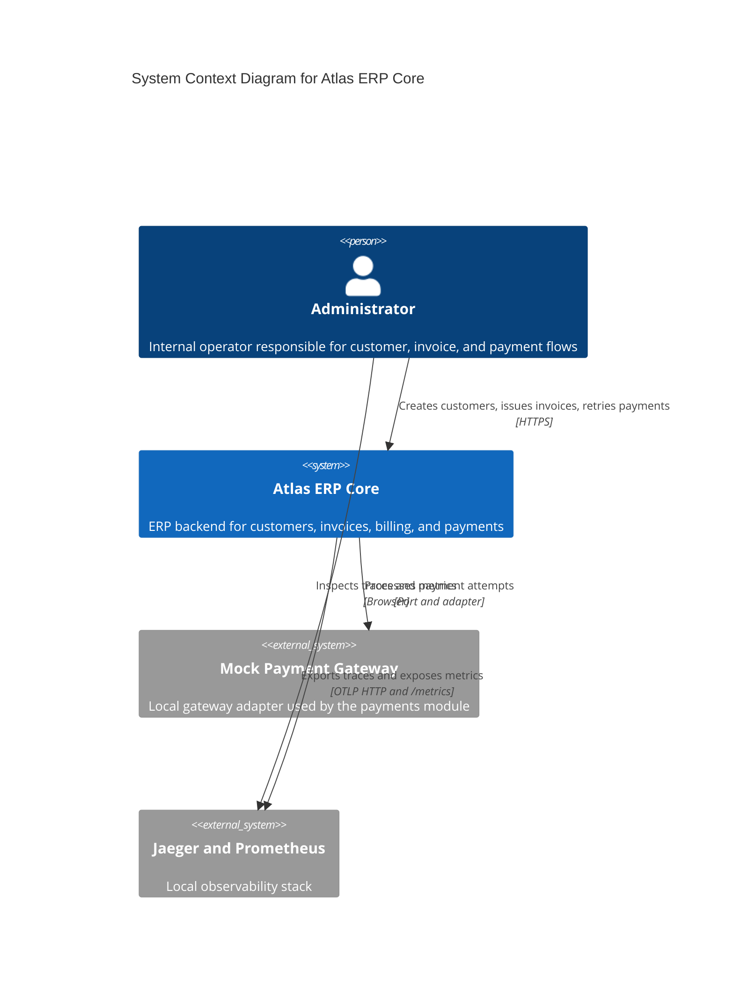
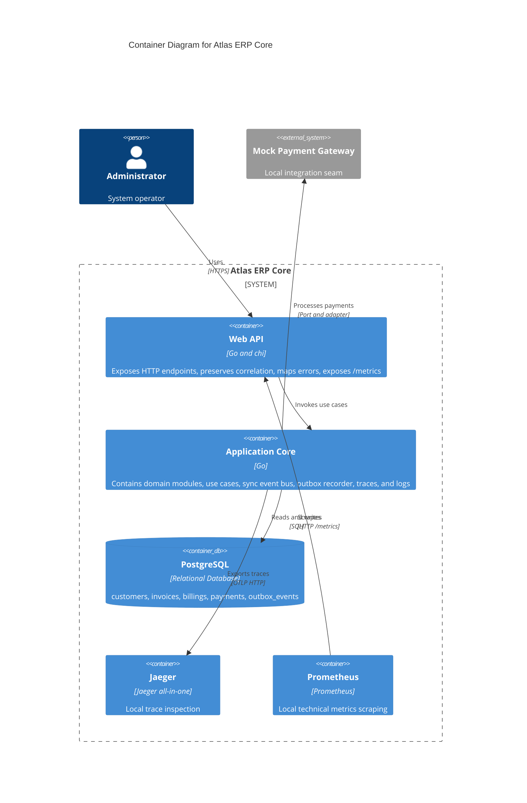
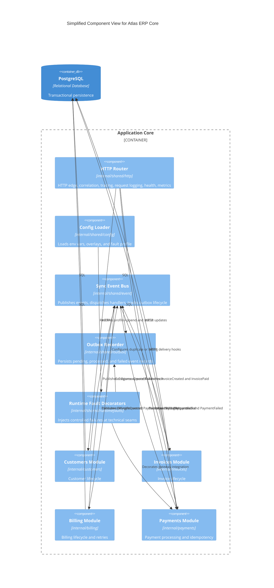

# Atlas ERP Core

ERP em Modular Monolith construido em Go com DDD, Clean Architecture e comunicacao interna orientada a eventos.

Companion principal em ingles: [README.md](README.md)

## Proposito

Atlas ERP Core modela um backbone financeiro de ERP com cadastro de clientes, emissao de invoices, geracao de billing, processamento de pagamentos e liquidacao de invoices.

O projeto existe por dois motivos:

- implementar um core transacional com fronteiras modulares explicitas e comportamento auditavel
- servir como referencia de portfolio que explica arquitetura, trade-offs, resiliencia, observabilidade e evolucao futura usando codigo e testes reais

Este repositorio prioriza clareza tecnica acima de volume de funcionalidades. O valor esta em como o sistema foi estruturado, por que foi estruturado assim e como ele pode evoluir com seguranca.

## Visao Arquitetural

Atlas ERP Core usa Modular Monolith como estilo principal, DDD para modelagem de dominio, Clean Architecture para organizacao interna e eventos in-process para comunicacao entre modulos.

Essas escolhas resolvem problemas concretos:

- Modular Monolith reduz custo de deploy e debugging sem abrir mao de limites de dominio.
- DDD mantem regras de negocio dentro de aggregates, value objects e use cases.
- Clean Architecture impede que detalhes de infraestrutura passem a dirigir o modelo de dominio.
- Eventos internos reduzem acoplamento direto entre modulos e preparam o sistema para extracao futura sem fingir distribuicao hoje.

O resultado e um unico runtime implantavel com contratos explicitos, superficies publicas por modulo, fluxos observaveis e um caminho documentado para evolucao distribuida quando houver pressao operacional real.

## Visao de Dominio

Os bounded contexts ativos sao:

| Modulo | Responsabilidade | Papel no sistema |
| --- | --- | --- |
| `customers` | Gestao do ciclo de vida de clientes | Cria, atualiza e inativa clientes com validacao de documento e email |
| `invoices` | Emissao e estado de invoices | Cria invoices, lista invoices por cliente e marca invoices como pagas |
| `billing` | Ciclo de cobranca e controle de retry | Cria billings a partir de invoices, controla `attempt_number` e estados intermediarios |
| `payments` | Execucao de pagamento e publicacao de resultado | Processa tentativas, aplica idempotencia, classifica falhas e publica eventos de resultado |

As capacidades tecnicas compartilhadas ficam em `internal/shared` e cobrem config, correlation, logging, observability, PostgreSQL, event dispatch, outbox e fault injection. O compartilhamento e tecnico, nao de regra de negocio.

### Contratos publicos dos modulos

| Modulo | Superficie publica |
| --- | --- |
| `customers` | `ExistenceChecker`, erros publicos, `public/events` |
| `invoices` | `public/events` |
| `billing` | `PaymentCompatibilityPort`, `BillingSnapshot`, erros publicos, `public/events` |
| `payments` | `public/events` |

## Visao de Arquitetura (C4)

Os diagramas abaixo resumem a arquitetura atual. Os diagramas detalhados por modulo e por sequencia continuam em [docs/diagrams/architecture.md](docs/diagrams/architecture.md).

### C4 Context



### C4 Container



### C4 Component



## Fluxo Principal

O fluxo principal ponta a ponta e:

```text
Create Customer -> Create Invoice -> InvoiceCreated -> BillingRequested -> PaymentApproved -> Invoice Paid
```

Na pratica:

1. O operador cria um cliente via `POST /customers`.
2. O operador cria uma invoice via `POST /invoices`.
3. `invoices` persiste a invoice e publica `InvoiceCreated`.
4. `billing` consome `InvoiceCreated`, cria o billing e publica `BillingRequested`.
5. `payments` consome `BillingRequested`, reserva uma tentativa, chama o gateway e publica `PaymentApproved` ou `PaymentFailed`.
6. `billing` e `invoices` reagem aos eventos financeiros para fechar o estado da cobranca e marcar a invoice como paga quando houver aprovacao.

Tambem existe um caminho de compatibilidade para retry manual:

```text
POST /payments -> reprocess an existing billing after PaymentFailed or technical gateway failure
```

Esse fluxo orientado a eventos reduz acoplamento entre modulos mantendo um unico runtime e debugging deterministico.

## Stack Tecnologica

| Area | Tecnologia |
| --- | --- |
| Linguagem | Go 1.26 |
| HTTP | `chi` |
| Persistencia | PostgreSQL com `pgx/v5` |
| Migracoes | `golang-migrate` |
| Logging | `log/slog` em JSON |
| Tracing e metricas | OpenTelemetry Go SDK e `otelhttp` |
| Observabilidade local | Jaeger e Prometheus |
| Testes de integracao | `testcontainers-go` |
| Runtime local | Docker e Docker Compose |
| CI baseline | GitHub Actions |

## Como Executar

A documentacao publicada usa comandos shell normais e atalhos do Makefile. Wrappers locais nao fazem parte da interface publica do projeto.

### 1. Preparar o ambiente

```bash
cp .env.example .env
```

Variaveis principais:

| Variavel | Obrigatoria | Default | Uso |
| --- | --- | --- | --- |
| `APP_PORT` | Sim | - | Porta HTTP |
| `DB_HOST` | Sim | - | Host do PostgreSQL |
| `DB_PORT` | Sim | - | Porta do PostgreSQL |
| `DB_USER` | Sim | - | Usuario do PostgreSQL |
| `DB_PASSWORD` | Sim | - | Senha do PostgreSQL |
| `DB_NAME` | Sim | - | Banco do PostgreSQL |
| `APP_NAME` | Nao | `atlas-erp-core` | Nome logico do servico |
| `APP_ENV` | Nao | `local` | Ambiente atual |
| `LOG_LEVEL` | Nao | `info` | Nivel de log |
| `CORRELATION_ID_HEADER` | Nao | `X-Correlation-ID` | Header de correlacao |
| `ATLAS_FAULT_PROFILE` | Nao | `none` | Perfil controlado de falha local |
| `PAYMENT_GATEWAY_TIMEOUT_MS` | Nao | `2000` | Timeout por tentativa |
| `OTEL_EXPORTER_OTLP_ENDPOINT` | Nao | vazio | Endpoint OTLP HTTP |

### 2. Subir a stack local

Atalho principal:

```bash
make up
```

Comando equivalente:

```bash
docker compose up --build -d
```

Servicos esperados:

- API em `http://localhost:8080`
- PostgreSQL em `localhost:5432`
- Jaeger em `http://localhost:16686`
- Prometheus em `http://localhost:9090`

### 3. Rodar migracoes

Atalho:

```bash
make migrate-up
```

Comando equivalente:

```bash
go run ./cmd/migrate --direction up
```

### 4. Rodar a API a partir do codigo

Atalho:

```bash
make run
```

Comando equivalente:

```bash
go run ./cmd/api
```

Para visualizar traces no Jaeger ao rodar a API fora do Compose:

```bash
OTEL_EXPORTER_OTLP_ENDPOINT=http://localhost:4318 make run
```

### 5. Validar health e metrics

```bash
curl http://localhost:8080/health
curl http://localhost:8080/metrics
```

### 6. Rodar a suite completa

Atalho:

```bash
make test
```

Comando equivalente:

```bash
go test ./...
```

### HTTP endpoints

| Metodo | Path | Descricao |
| --- | --- | --- |
| `GET` | `/health` | Healthcheck |
| `GET` | `/metrics` | Metricas Prometheus |
| `POST` | `/customers` | Criar cliente |
| `PUT` | `/customers/{id}` | Atualizar cliente |
| `PATCH` | `/customers/{id}/inactive` | Inativar cliente |
| `POST` | `/invoices` | Criar invoice e disparar billing e payment |
| `GET` | `/customers/{id}/invoices` | Listar invoices por cliente |
| `POST` | `/payments` | Retry manual de pagamento sobre billing existente |

Mais exemplos operacionais estao em [docs/commands.md](docs/commands.md).

## Estrategia de Testes

Atlas ERP Core usa validacao orientada a comportamento com multiplas camadas de evidencia.

### Testes unitarios

Validam:

- invariantes de dominio e transicoes de aggregate
- orquestracao de use cases
- construtores de eventos e consistencia do catalogo publico
- validacao HTTP e mapeamento canonico de erro
- config, logging, correlation, observability e runtime faults

### Testes de integracao

Usam PostgreSQL real via `testcontainers-go` e validam:

- persistencia e migracoes
- append e lifecycle do outbox
- protecao contra entrega duplicada
- fluxos de retry
- timeout e classificacao de falha de gateway
- persistencia do envelope em `outbox_events`

### Testes funcionais

Validam o sistema pela borda HTTP:

- fluxo ponta a ponta de invoice
- retry manual apos falha
- error bodies canonicos e rastreabilidade
- propagacao de observabilidade
- fault profiles controlados pela API publica

### Validacao orientada a eventos

O comportamento orientado a eventos esta coberto por testes de:

- ordem de publish e consume
- duplicacao de `BillingRequested`
- falha injetada de consumer
- falha no append do outbox
- transicao da invoice apos `PaymentApproved`

### Cenarios de falha cobertos por teste

A suite cobre:

- timeout de gateway
- falha intermitente de gateway com retry manual bem-sucedido
- duplicacao de entrega de evento
- falha de consumer durante dispatch
- falha de append do outbox antes de side effects downstream

## Observabilidade

Observabilidade e tratada como requisito arquitetural, nao como detalhe posterior.

### Logs

Os logs usam JSON estruturado via `slog` e incluem, quando aplicavel:

- `module`
- `request_id`
- `event_id`
- `aggregate_id`
- `correlation_id`
- `trace_id`
- `span_id`
- `event_name`
- `attempt_number`
- `retry_count`
- `failure_category`
- `error_type`

### Correlation

As requests preservam `X-Correlation-ID` por default e o expõem como `request_id` em logs e respostas de erro.

### Tracing

OpenTelemetry cobre:

- requests HTTP
- use cases
- publish e consume de eventos internos
- queries PostgreSQL
- integracao com gateway de pagamento

Span names principais:

- `http.request {METHOD} {route}`
- `application.usecase {module}.{UseCase}`
- `event.publish {EventName}`
- `event.consume {consumer_module}.{EventName}`
- `db.query {operation} {table}`
- `integration.gateway payments.Process`

Jaeger UI: `http://localhost:16686`

### Metrics

Prometheus em `GET /metrics` expõe sinais para:

- contagem, erro e duracao de request HTTP
- publicacao e consumo de eventos
- falhas de handlers
- retries de pagamento
- duracao de query de banco
- duracao e falhas de gateway

Prometheus UI: `http://localhost:9090`

## Resiliencia

A resiliencia do projeto e intencionalmente explicita, estreita e auditavel.

### Idempotencia

`payments` aplica idempotencia por `(billing_id, attempt_number)` e persiste `idempotency_key` para impedir pagamento aprovado duplicado quando houver redelivery.

### Retry

`billing` controla a progressao monotona de `attempt_number` e so reativa um billing quando o retry e legitimo. `POST /payments` e o caminho de compatibilidade para retry manual apos `PaymentFailed` ou falha tecnica do gateway.

### Tratamento de falhas

Falhas tecnicas do gateway viram tentativas persistidas com status de falha, em vez de sumirem como erro de transporte. Isso preserva auditoria e mantem a invoice retryable.

### Timeout

`PAYMENT_GATEWAY_TIMEOUT_MS` limita cada tentativa. Timeouts recebem `failure_category=gateway_timeout`, ficando visiveis em logs, persistencia e traces.

## Sistema de Eventos

Os modulos se comunicam principalmente por um event bus sincronico em `internal/shared/event`.

### Envelope de evento

Todos os eventos publicos compartilham o mesmo envelope:

```json
{
  "metadata": {
    "event_id": "uuid",
    "event_name": "BillingRequested",
    "occurred_at": "2026-03-25T10:00:00Z",
    "aggregate_id": "uuid",
    "correlation_id": "req-123"
  },
  "payload": {}
}
```

### Catalogo de eventos

| Evento | Producer | Consumers |
| --- | --- | --- |
| `CustomerCreated` | `customers` | nenhum |
| `InvoiceCreated` | `invoices` | `billing` |
| `BillingRequested` | `billing` | `payments` |
| `PaymentApproved` | `payments` | `billing`, `invoices` |
| `PaymentFailed` | `payments` | `billing` |
| `InvoicePaid` | `invoices` | nenhum |

O dispatch e sincronico por design hoje, o que mantem comportamento local deterministico mas tambem permite que falhas tecnicas downstream afetem a conclusao upstream.

## Outbox

Atlas ERP Core inclui um outbox recorder como preparacao para distribuicao, nao como sistema distribuido de entrega.

O que existe hoje:

- `outbox_events` persiste eventos publicados
- os registros carregam `event_name`, `aggregate_id`, `correlation_id`, `payload`, timestamps e metadados de lifecycle
- o lifecycle atual e `pending -> processed` ou `pending -> failed`
- essas mudancas refletem apenas o dispatch sincronico existente hoje

O que ainda nao existe:

- nao ha dispatcher assincrono
- nao ha broker externo
- nao ha replay duravel nem dead-letter workflow

Isso mantem a narrativa honesta: o outbox atual e preparacao arquitetural e evidencia de auditoria, nao garantia de consistencia distribuida.

## Trade-offs

O projeto permanece deliberadamente como Modular Monolith.

### Por que nao microservices ainda

- Um unico deployable ainda e mais barato de operar do que um runtime distribuido.
- O trafego e o tamanho atual do dominio nao justificam broker, rede e complexidade de deploy.
- Contratos publicos e envelope de eventos ja criam o caminho para extracao futura sem pagar o custo de sistemas distribuidos agora.

### Limites do monolito

- ownership fisico do banco ainda e compartilhado
- dispatch sincronico acopla conclusao upstream a sucesso downstream
- a pressao de extracao esta documentada, nao exercitada em producao
- disciplina arquitetural precisa ser mantida por contratos, testes e governanca

### Riscos residuais

- falha no append do outbox pode deixar persistencia upstream concluida e bloquear efeitos downstream
- entrega duplicada e simulada e testada, mas ainda nao existe pipeline duravel de replay
- benchmark e evidencia local, nao garantia de producao

A explicacao arquitetural mais longa esta em [docs/architecture/trade-offs.md](docs/architecture/trade-offs.md) e [docs/architecture/distribution-readiness.md](docs/architecture/distribution-readiness.md).

## Benchmarks e Metricas

Phase 7 adiciona uma suite reproduzivel de benchmark HTTP em `test/benchmark`.

Cenarios cobertos:

- `BenchmarkCreateCustomer`
- `BenchmarkCreateInvoice`
- `BenchmarkProcessPaymentRetry`
- `BenchmarkEndToEndFlow`

Campos reportados:

- `avg_ms`
- `p95_ms`
- `ops_per_sec`
- `error_rate_pct`

### Baseline atualmente commitado

O artefato atual em [docs/benchmarks/phase7-baseline.md](docs/benchmarks/phase7-baseline.md) foi gerado em `2026-03-25T23:53:11Z` com:

- status: `no_samples`
- note: Docker ou PostgreSQL via testcontainers nao estava disponivel no momento da coleta

Como nenhuma amostra foi capturada, este README nao inventa numeros de latencia, throughput ou percentil.

### Como regenerar o baseline

```bash
go test -run '^$' -bench . -benchmem -benchtime=10x ./test/benchmark
```

Para exportar Markdown e JSON:

```bash
go test -run '^$' -bench . -benchmem -benchtime=10x ./test/benchmark \
  -args \
  -report-json docs/benchmarks/phase7-baseline.json \
  -report-md docs/benchmarks/phase7-baseline.md
```

Esses benchmarks sao evidencia local de portfolio. Eles nao sao gate de CI nem devem ser tratados como garantia de producao.

## Cenarios de Falha

Phase 7 adiciona fault profiles controlados via `ATLAS_FAULT_PROFILE` para explicar a arquitetura sob stress tecnico previsivel.

| Profile | Ponto de injecao | Resultado esperado |
| --- | --- | --- |
| `payment_timeout` | decorator do gateway | tentativa falha com `gateway_timeout`, invoice permanece pending |
| `payment_flaky_first` | decorator do gateway | primeira tentativa falha, retry manual pode aprovar a segunda |
| `duplicate_billing_requested` | hook de duplicacao no event bus | duplicacao nao cria pagamento aprovado duplicado |
| `event_consumer_failure` | hook de falha do consumer | registro `BillingRequested` no outbox vira `failed`, sem aprovacao downstream |
| `outbox_append_failure` | decorator do outbox | aggregate upstream permanece persistido, append falha e side effects downstream nao rodam |

Exemplo:

```bash
ATLAS_FAULT_PROFILE=payment_timeout OTEL_EXPORTER_OTLP_ENDPOINT=http://localhost:4318 go run ./cmd/api
```

O detalhamento de cenarios esta em [docs/architecture/failure-scenarios.md](docs/architecture/failure-scenarios.md).

## ADRs

O catalogo de decisoes arquiteturais esta em [docs/adr/README.md](docs/adr/README.md).

Decisoes aceitas:

| ADR | Foco | Resumo |
| --- | --- | --- |
| [0001](docs/adr/0001-phase-0-foundation.md) | Foundation | Bootstrap, runtime, CI e base do repositorio |
| [0002](docs/adr/0002-phase-1-core-domain.md) | Core domain | Modular Monolith, DDD, Clean Architecture e primeiro fluxo transacional |
| [0003](docs/adr/0003-phase-3-event-driven-internal.md) | Eventos internos | Comunicacao sincronica in-process |
| [0004](docs/adr/0004-phase-4-resilience-and-maturity.md) | Resiliencia | Idempotencia por tentativa, retry, timeout e preparacao de outbox |
| [0005](docs/adr/0005-phase-5-observability-and-operations.md) | Observabilidade | Traces, metricas, logs, Jaeger e Prometheus |
| [0006](docs/adr/0006-phase-6-architectural-evolution-and-distribution-readiness.md) | Distribution readiness | Contratos publicos, envelope, lifecycle do outbox e criterio de extracao |

## Roadmap

Fase atual: **Phase 7 - Portfolio Differentiation & Advanced Engineering**

Proximas evolucoes:

- externalizar o event bus apenas quando houver pressao real de distribuicao
- introduzir mensageria externa quando entrega assincrona trouxer beneficio concreto
- avaliar extracao de `payments` primeiro e depois `billing` se escala, ownership ou compliance exigirem
- explorar multi-tenancy somente depois de estabilizar os limites atuais do dominio
- aprofundar auditoria e evidencia operacional sem inflar o runtime antes da hora

## Status do Projeto

Fase atual: **Phase 7 - Portfolio Differentiation & Advanced Engineering**

O repositorio esta intencionalmente posicionado como referencia tecnica de portfolio:

- fluxo ponta a ponta implementado e observavel
- resiliencia explicita e coberta por testes
- diagramas, ADRs, trade-offs e failure scenarios documentados
- benchmark e fault injection presentes como evidencia de engenharia

## Aprendizados-Chave

Atlas ERP Core demonstra:

- como manter um monolito modular sem fingir que ele ja e distribuido
- como DDD e Clean Architecture continuam praticos quando sustentados por contratos explicitos e testes
- como colaboracao orientada a eventos reduz acoplamento antes da introducao de mensageria externa
- como idempotencia, retry, timeout e preparacao de outbox podem ser adicionados de forma incremental
- como observabilidade, benchmarks, ADRs e trade-offs transformam codigo-fonte em narrativa tecnica defensavel

## Referencias de Apoio

- Notion hub: [Atlas ERP Core](https://www.notion.so/mrgomides/Atlas-ERP-Core-32ae01f2262680aea1a1dd408f0001d9?source=copy_link)
- Commands: [docs/commands.md](docs/commands.md)
- Architecture diagrams: [docs/diagrams/architecture.md](docs/diagrams/architecture.md)
- Distribution readiness: [docs/architecture/distribution-readiness.md](docs/architecture/distribution-readiness.md)
- Failure scenarios: [docs/architecture/failure-scenarios.md](docs/architecture/failure-scenarios.md)
- Trade-offs: [docs/architecture/trade-offs.md](docs/architecture/trade-offs.md)
- Benchmark baseline: [docs/benchmarks/phase7-baseline.md](docs/benchmarks/phase7-baseline.md)
- ADR catalog: [docs/adr/README.md](docs/adr/README.md)
