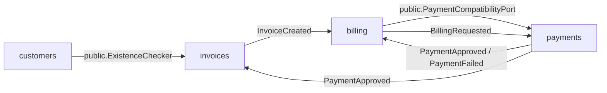

# Distribution Readiness

## Current state

Atlas ERP Core continua como um modular monolith em um unico processo Go, com PostgreSQL compartilhado fisicamente, eventos internos in-process e observabilidade ponta a ponta.

Na Phase 6, a preparacao para futura distribuicao passou a depender de tres pilares explicitos:

- contratos publicos por modulo em `internal/<module>/public`
- eventos publicos padronizados por envelope em `internal/<module>/public/events`
- `outbox_events` com lifecycle `pending -> processed|failed` no dispatch sincronico atual

## Dependency map



## Public contracts by module

| Module | Public contracts | Why it exists |
| --- | --- | --- |
| `customers` | `ExistenceChecker`, `ErrCustomerNotFound`, `ErrCustomerInactive`, event catalog | permitir emissao de invoice sem vazar repositorio ou aggregate |
| `invoices` | event catalog | publicar fatos de faturamento sem expor internals do modulo |
| `billing` | `PaymentCompatibilityPort`, `BillingSnapshot`, `ErrBillingNotFound`, `ErrBillingAlreadyApproved`, event catalog | suportar retry manual e processamento de pagamento com ownership claro |
| `payments` | event catalog | publicar resultado financeiro sem acoplamento em `domain/events` |

## Internal event catalog

| Event | Aggregate | Producer | Consumers | Payload focus |
| --- | --- | --- | --- | --- |
| `CustomerCreated` | `customer` | `customers` | none | `customer_id` |
| `InvoiceCreated` | `invoice` | `invoices` | `billing` | invoice, customer, amount, due date |
| `BillingRequested` | `billing` | `billing` | `payments` | billing, invoice, customer, attempt, amount |
| `PaymentApproved` | `payment` | `payments` | `billing`, `invoices` | payment, billing, invoice, attempt, gateway ref |
| `PaymentFailed` | `payment` | `payments` | `billing` | payment, billing, invoice, attempt, failure category |
| `InvoicePaid` | `invoice` | `invoices` | none | `invoice_id` |

Envelope comum:

```json
{
  "metadata": {
    "event_id": "uuid",
    "event_name": "BillingRequested",
    "occurred_at": "2026-03-25T10:00:00Z",
    "aggregate_id": "uuid",
    "correlation_id": "req-123"
  },
  "payload": {}
}
```

## Extraction candidates

### 1. Payments

Principal candidato a extracao futura porque:

- concentra a integracao externa mais evidente
- possui requisitos naturais de idempotencia, timeout e retry
- tem fronteira de entrada clara via `BillingRequested`
- tende a ter pressao operacional diferente do restante do ERP

### 2. Billing

Segundo candidato porque:

- concentra o ciclo de tentativas e estados intermediarios de cobranca
- pode evoluir para um coordenador assincrono quando houver broker real
- ja possui contrato publico para o caminho de retry manual

## Current blockers for clean extraction

- PostgreSQL ainda e compartilhado fisicamente e sem ownership tecnico por schema/banco
- event bus continua in-process, sem transporte externo ou dispatcher assincrono
- bootstrap em `cmd/api/main.go` ainda compoe tudo no mesmo runtime
- `internal/shared` ainda centraliza observabilidade, HTTP, correlacao e persistencia comum
- contratos publicos acabaram de ser explicitados e ainda nao foram exercitados em fronteiras de rede

## Criteria to leave the modular monolith

Distribuir o sistema so deve entrar em pauta quando pelo menos um destes sinais aparecer:

- throughput ou latencia de `payments` exigir escala operacional independente
- integracoes externas de pagamento passarem a exigir SLA, release cadence ou segredos isolados
- backlog de cobranca justificar dispatcher assíncrono real e consumo desacoplado
- ownership de time ou compliance pedir isolamento de runtime e deploy

## Trade-offs of staying modular now

- simplicidade operacional permanece alta
- debugging ponta a ponta continua mais barato
- transacoes locais ainda sao mais simples que coordenacao distribuida
- a disciplina arquitetural agora precisa compensar a ausencia de isolamento fisico
