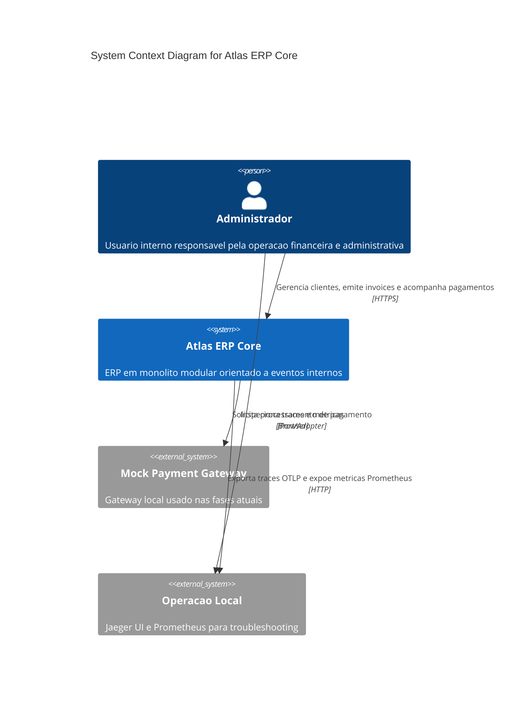
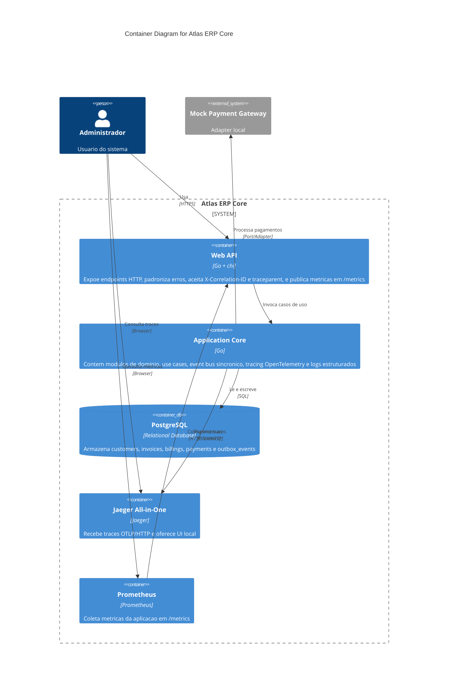
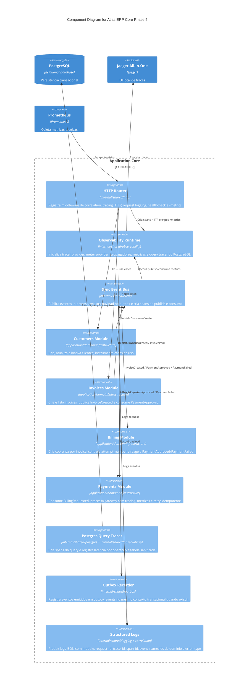
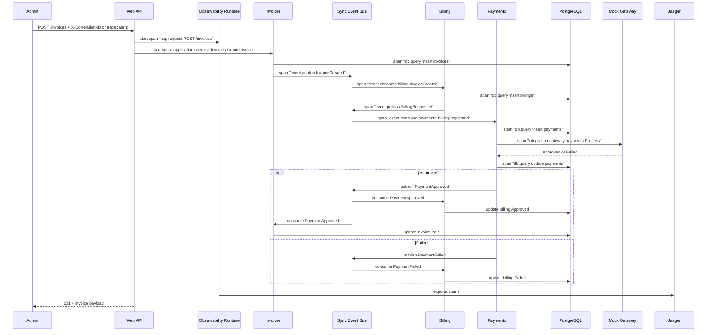
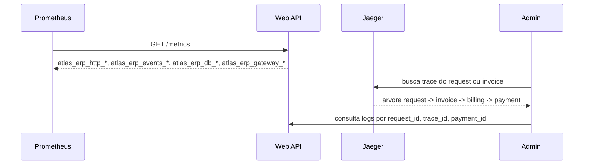
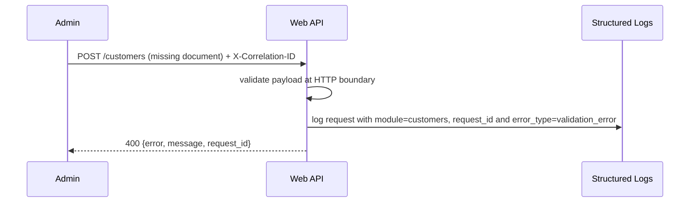

# Atlas ERP Core Architecture

## C1 - Context

## C2 - Containers

## C3 - Phase 5 Components

## Sequence - Automatic Event-Driven Flow With Observability

## Sequence - Metrics And Troubleshooting

## Sequence - Validation Failure

