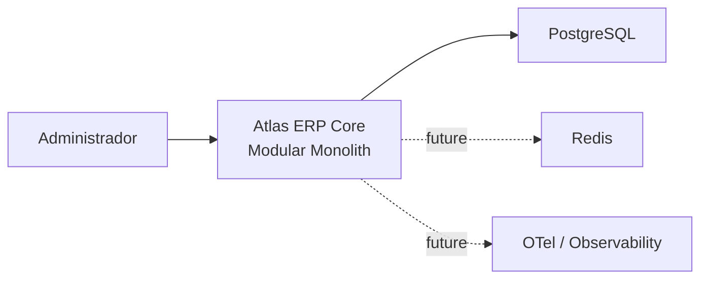
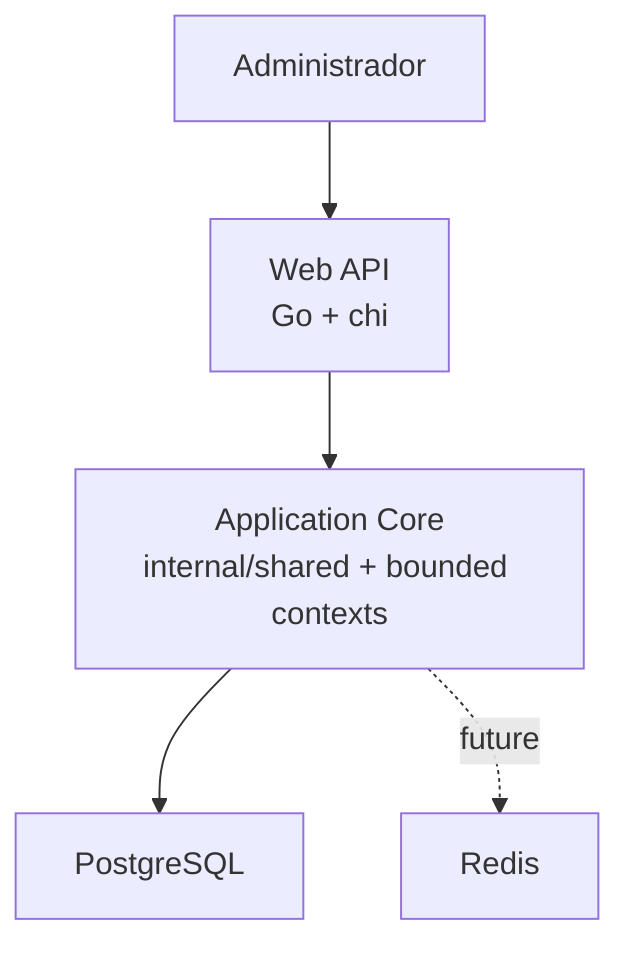
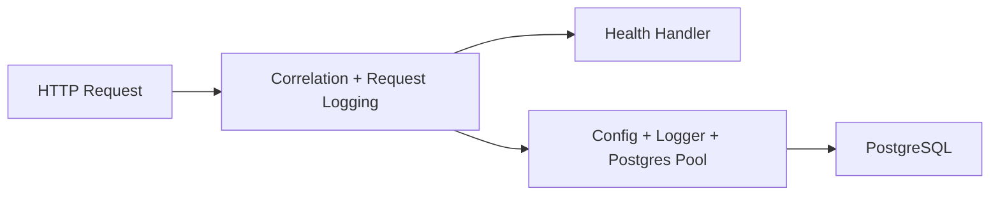

# Atlas ERP Core Architecture

## C1 - Context

```mermaid
flowchart LR
    Admin["Administrador"] --> API["Atlas ERP Core\nModular Monolith"]
    API --> DB["PostgreSQL"]
    API -. "future" .-> Redis["Redis"]
    API -. "future" .-> OTel["OTel / Observability"]
```

## C2 - Containers

```mermaid
flowchart TB
    User["Administrador"] --> WebAPI["Web API\nGo + chi"]
    WebAPI --> AppCore["Application Core\ninternal/shared + bounded contexts"]
    AppCore --> Postgres["PostgreSQL"]
    AppCore -. "future" .-> Redis["Redis"]
```

## C3 - Foundation Components

```mermaid
flowchart LR
    Request["HTTP Request"] --> Middleware["Correlation + Request Logging"]
    Middleware --> Health["Health Handler"]
    Middleware --> Bootstrap["Config + Logger + Postgres Pool"]
    Bootstrap --> Database["PostgreSQL"]
```
