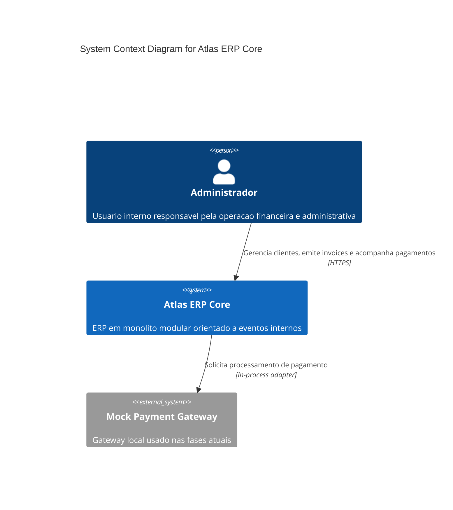
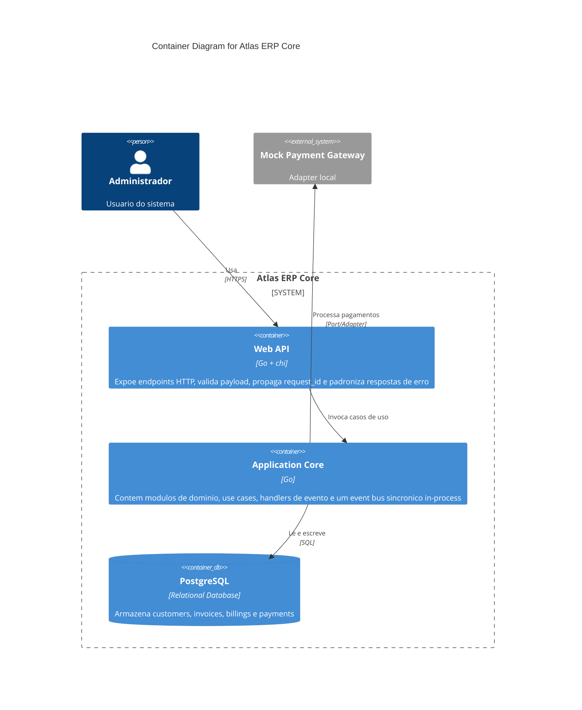
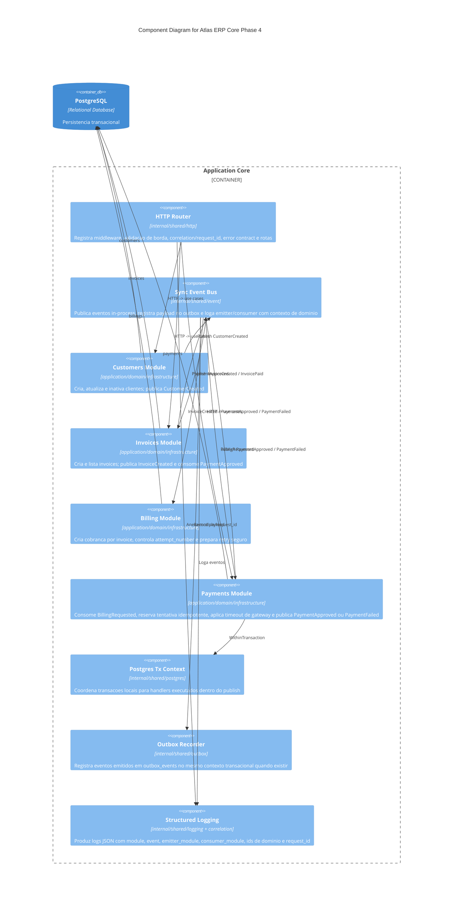
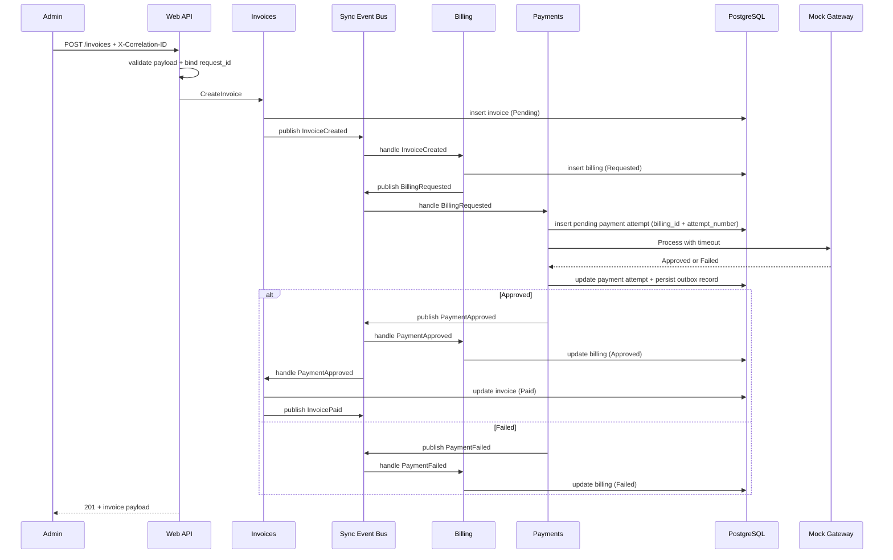
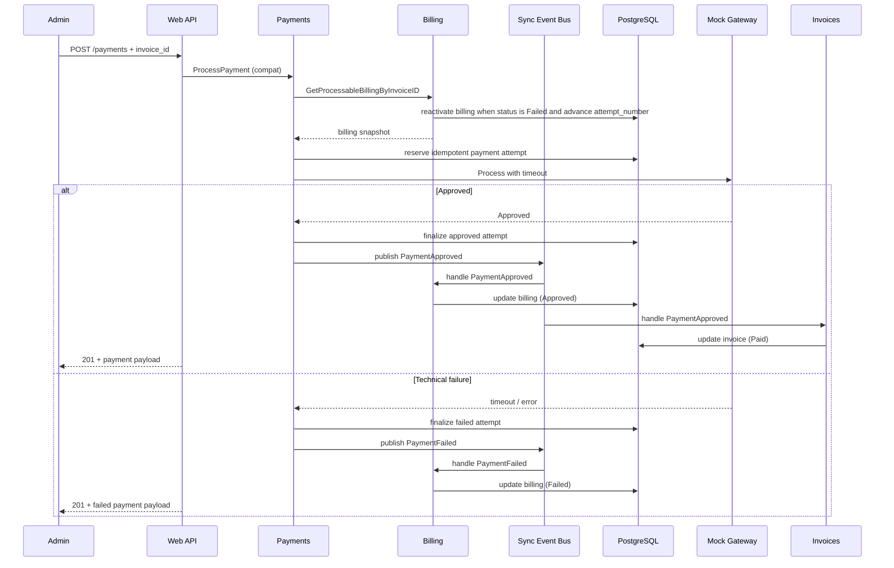
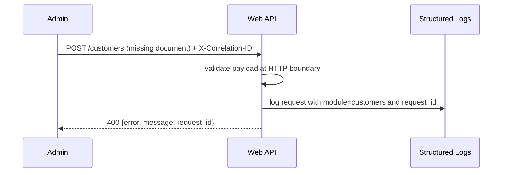

# Atlas ERP Core Architecture

## C1 - Context

## C2 - Containers

## C3 - Phase 4 Components

## Sequence - Automatic Event-Driven Flow With Resilience

## Sequence - Manual Retry

## Sequence - Validation Failure

