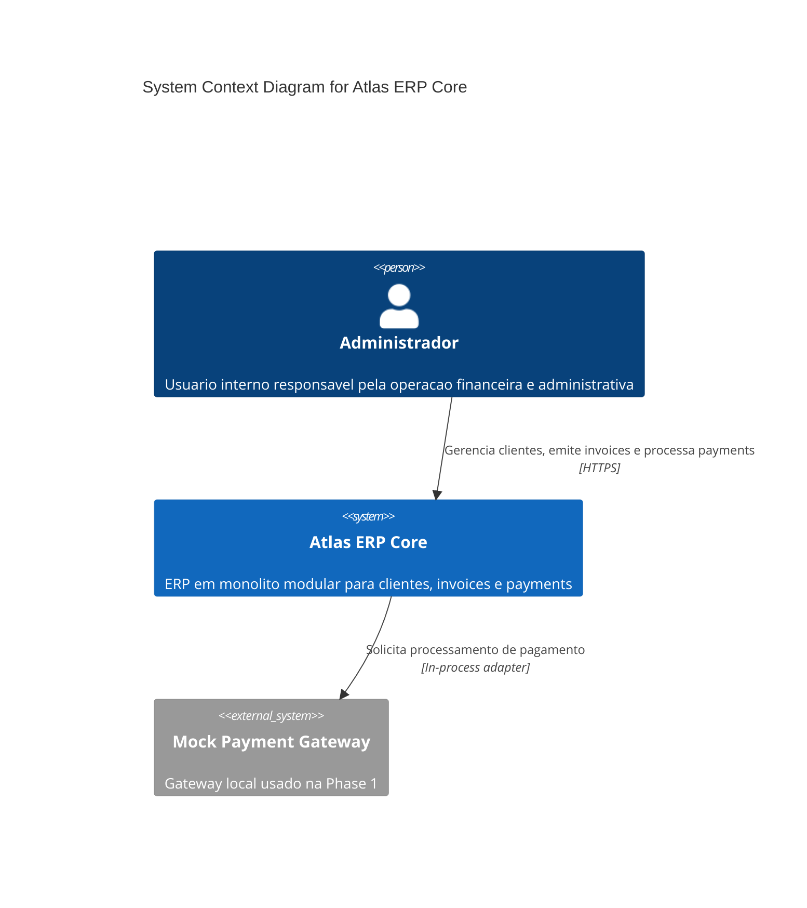
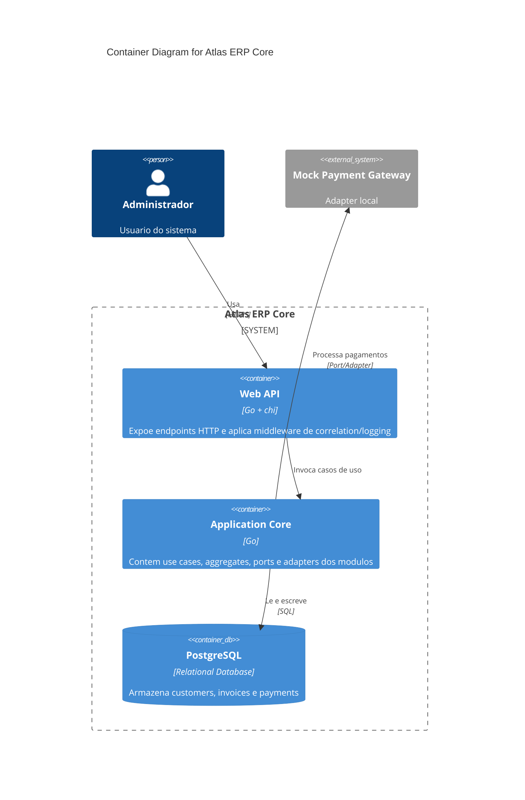
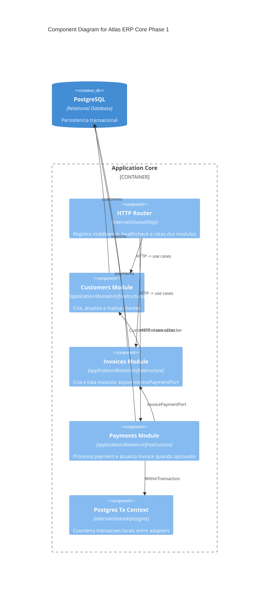
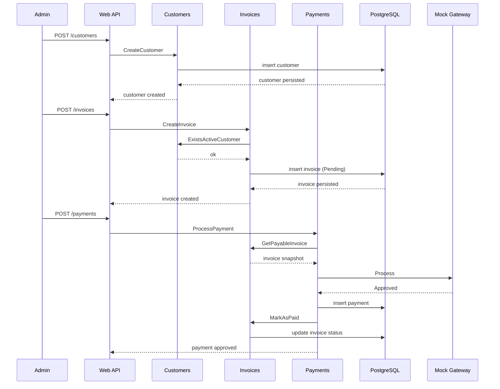

# Atlas ERP Core Architecture

## C1 - Context

```mermaid
C4Context
    title System Context Diagram for Atlas ERP Core

    Person(admin, "Administrador", "Usuario interno responsavel pela operacao financeira e administrativa")
    System(atlas, "Atlas ERP Core", "ERP em monolito modular para clientes, invoices e payments")
    System_Ext(payment_gateway, "Mock Payment Gateway", "Gateway local usado na Phase 1")

    Rel(admin, atlas, "Gerencia clientes, emite invoices e processa payments", "HTTPS")
    Rel(atlas, payment_gateway, "Solicita processamento de pagamento", "In-process adapter")
```

## C2 - Containers

```mermaid
C4Container
    title Container Diagram for Atlas ERP Core

    Person(admin, "Administrador", "Usuario do sistema")
    System_Ext(payment_gateway, "Mock Payment Gateway", "Adapter local")

    System_Boundary(atlas, "Atlas ERP Core") {
        Container(web_api, "Web API", "Go + chi", "Expoe endpoints HTTP e aplica middleware de correlation/logging")
        Container(app_core, "Application Core", "Go", "Contem use cases, aggregates, ports e adapters dos modulos")
        ContainerDb(main_db, "PostgreSQL", "Relational Database", "Armazena customers, invoices e payments")
    }

    Rel(admin, web_api, "Usa", "HTTPS")
    Rel(web_api, app_core, "Invoca casos de uso")
    Rel(app_core, main_db, "Le e escreve", "SQL")
    Rel(app_core, payment_gateway, "Processa pagamentos", "Port/Adapter")
```

## C3 - Phase 1 Components

```mermaid
C4Component
    title Component Diagram for Atlas ERP Core Phase 1

    Container_Boundary(core, "Application Core") {
        Component(router, "HTTP Router", "internal/shared/http", "Registra middleware, healthcheck e rotas dos modulos")
        Component(customers_module, "Customers Module", "application/domain/infrastructure", "Cria, atualiza e inativa clientes")
        Component(invoices_module, "Invoices Module", "application/domain/infrastructure", "Cria e lista invoices; expoe InvoicePaymentPort")
        Component(payments_module, "Payments Module", "application/domain/infrastructure", "Processa payment e atualiza invoice quando aprovado")
        Component(shared_pg, "Postgres Tx Context", "internal/shared/postgres", "Coordena transacoes locais entre adapters")
    }

    ContainerDb(main_db, "PostgreSQL", "Relational Database", "Persistencia transacional")

    Rel(router, customers_module, "HTTP -> use cases")
    Rel(router, invoices_module, "HTTP -> use cases")
    Rel(router, payments_module, "HTTP -> use cases")
    Rel(invoices_module, customers_module, "CustomerExistenceChecker")
    Rel(payments_module, invoices_module, "InvoicePaymentPort")
    Rel(payments_module, shared_pg, "WithinTransaction")
    Rel(customers_module, main_db, "customers")
    Rel(invoices_module, main_db, "invoices")
    Rel(payments_module, main_db, "payments")
```

## Sequence - End-to-End Flow

```mermaid
sequenceDiagram
    participant Admin
    participant API as Web API
    participant Customers
    participant Invoices
    participant Payments
    participant DB as PostgreSQL
    participant Gateway as Mock Gateway

    Admin->>API: POST /customers
    API->>Customers: CreateCustomer
    Customers->>DB: insert customer
    DB-->>Customers: customer persisted
    Customers-->>API: customer created

    Admin->>API: POST /invoices
    API->>Invoices: CreateInvoice
    Invoices->>Customers: ExistsActiveCustomer
    Customers-->>Invoices: ok
    Invoices->>DB: insert invoice (Pending)
    DB-->>Invoices: invoice persisted
    Invoices-->>API: invoice created

    Admin->>API: POST /payments
    API->>Payments: ProcessPayment
    Payments->>Invoices: GetPayableInvoice
    Invoices-->>Payments: invoice snapshot
    Payments->>Gateway: Process
    Gateway-->>Payments: Approved
    Payments->>DB: insert payment
    Payments->>Invoices: MarkAsPaid
    Invoices->>DB: update invoice status
    Payments-->>API: payment approved
```
