# Atlas ERP Core Architecture

## C1 - Context

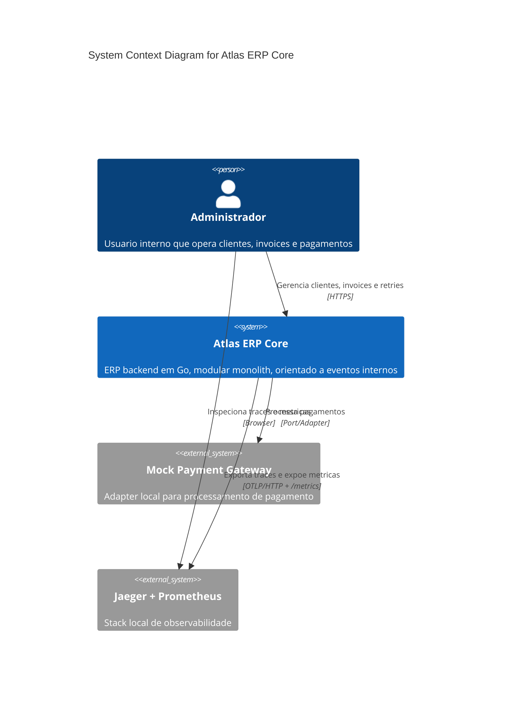

## C2 - Containers

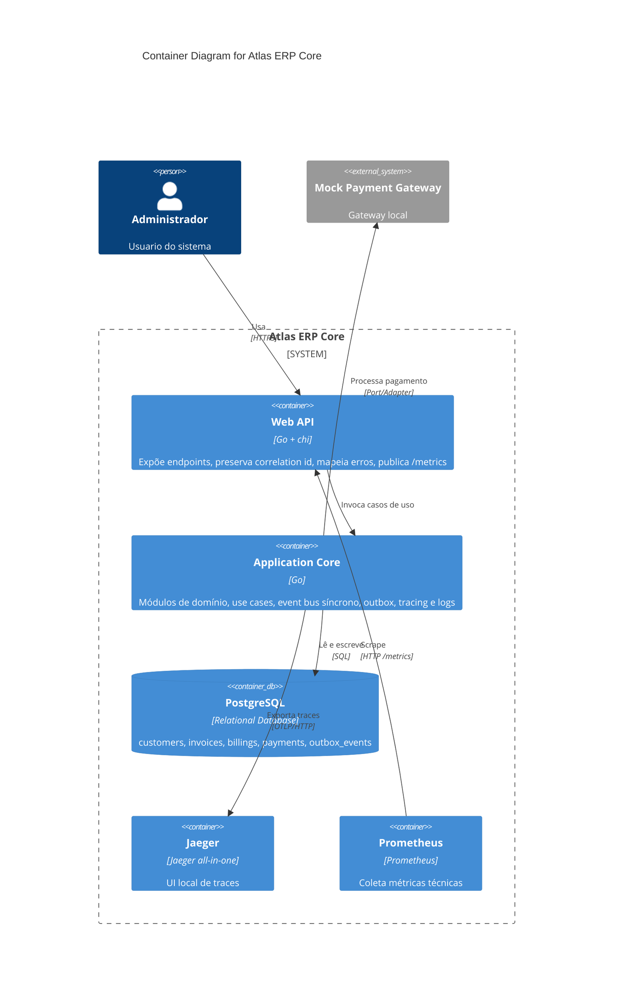

## C3 - Phase 7 Core Components

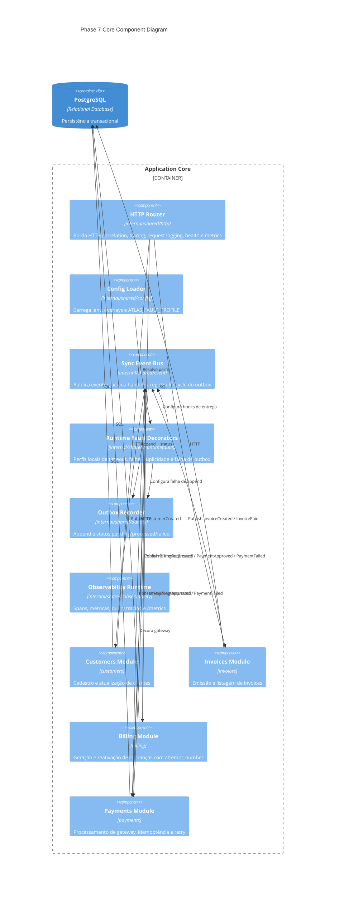

## C4 - Customers Module

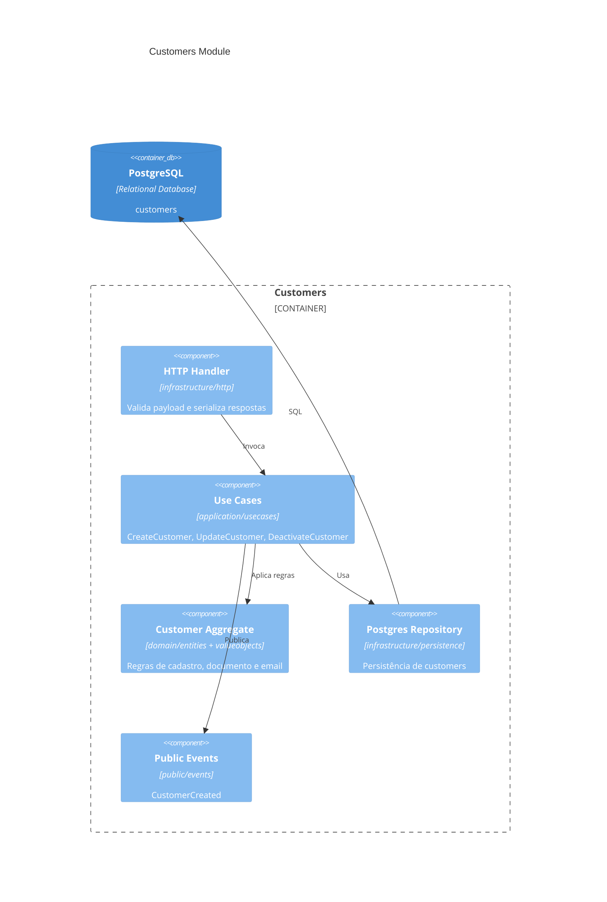

## C4 - Invoices Module

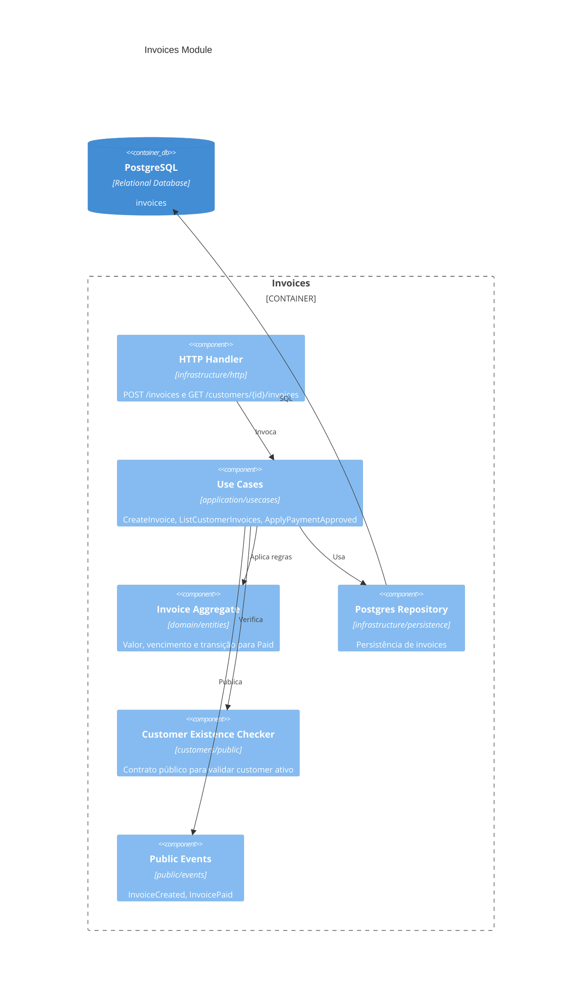

## C4 - Billing Module

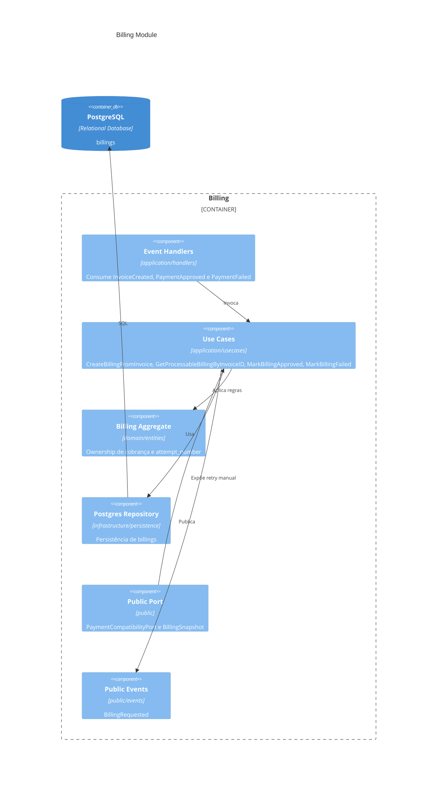

## C4 - Payments Module

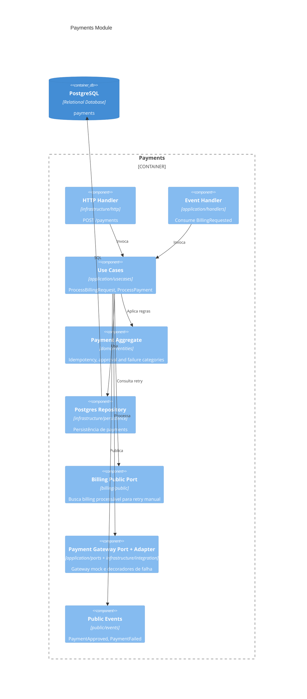

## Sequence - Create Customer

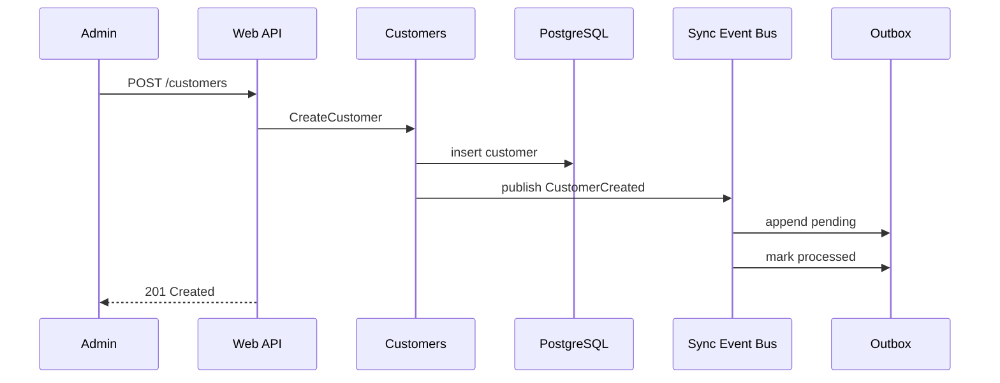

## Sequence - Create Invoice

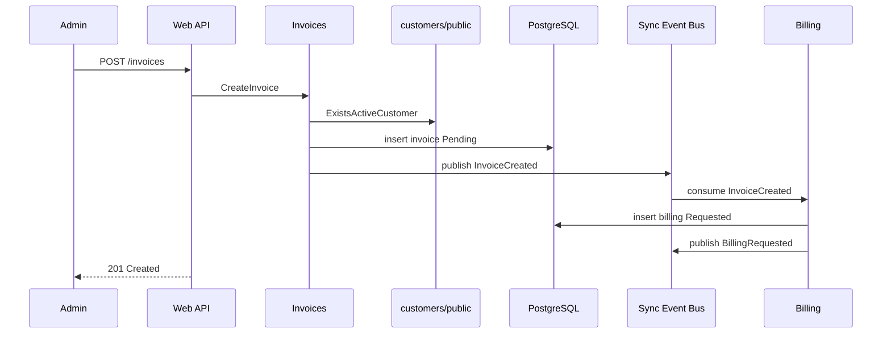

## Sequence - Process Payment Approved

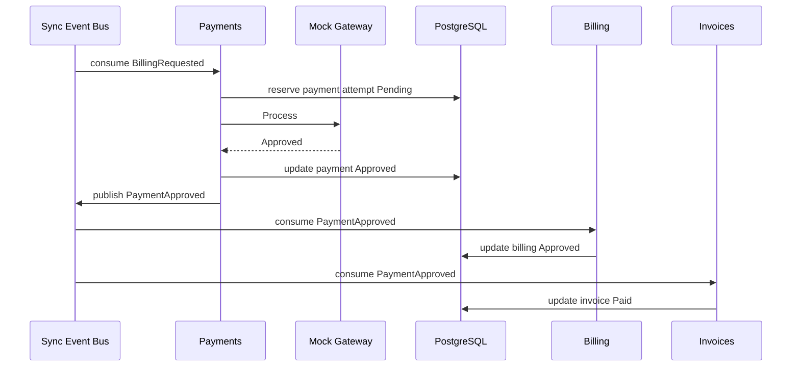

## Sequence - Process Payment Failed And Manual Retry

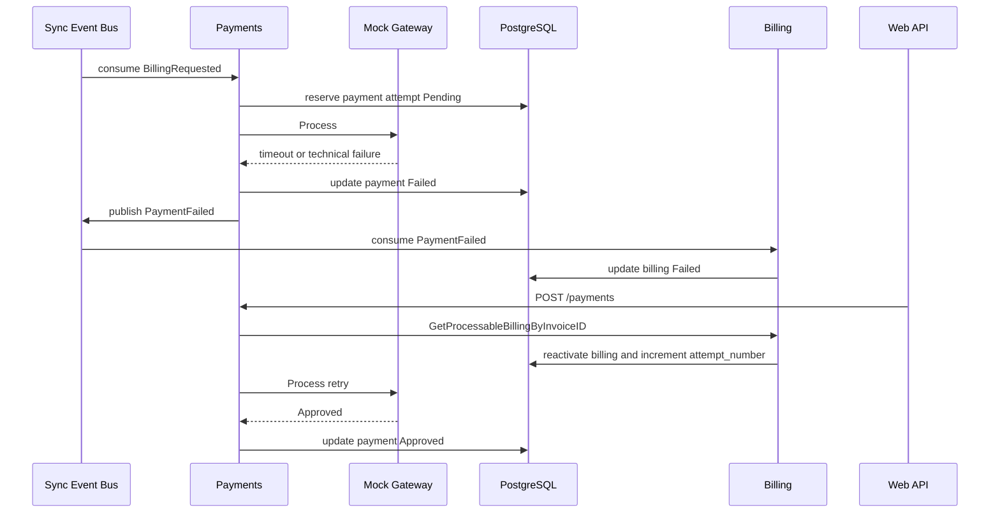

## Sequence - Internal Event Flow

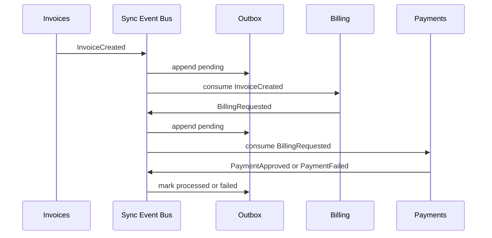

## Sequence - Persistence And Outbox Lifecycle

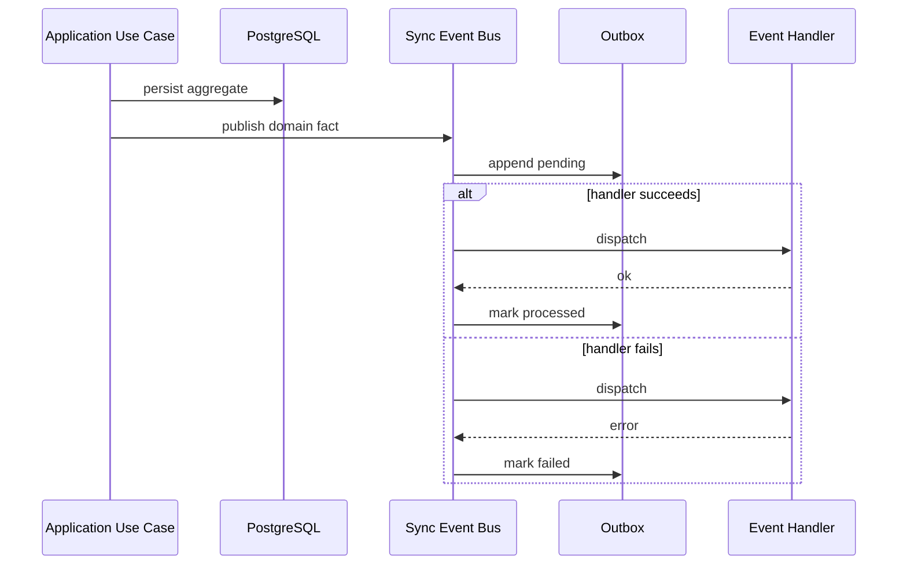

## Flowchart - Event Dependencies

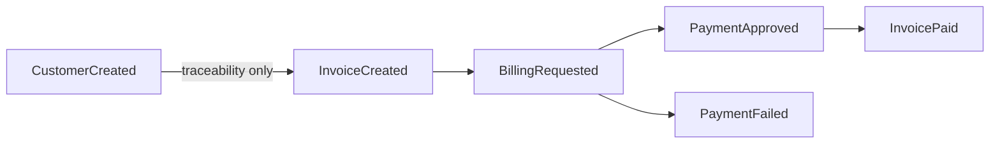
